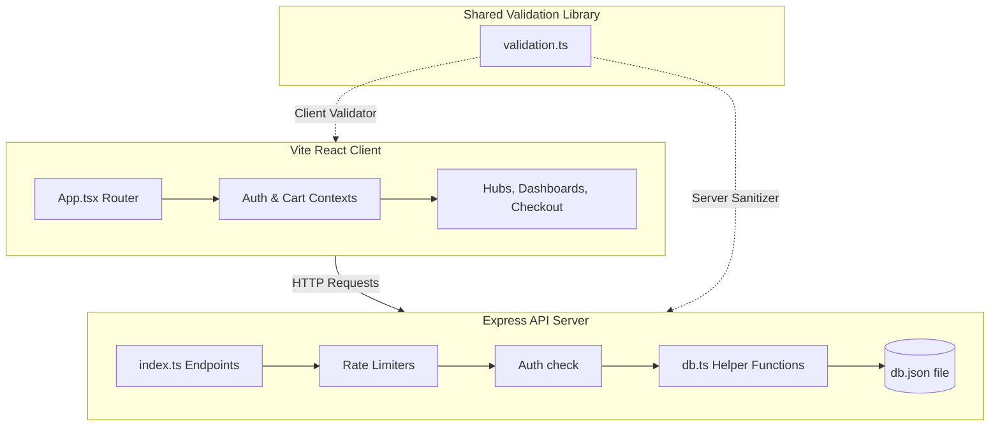
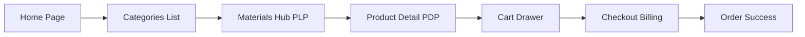
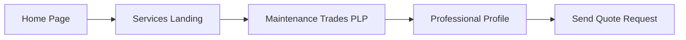
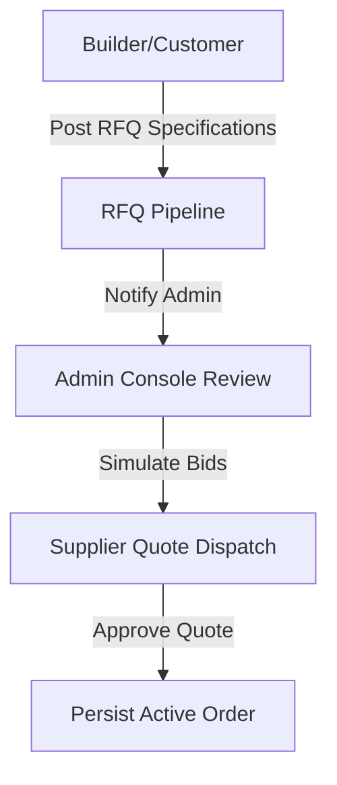
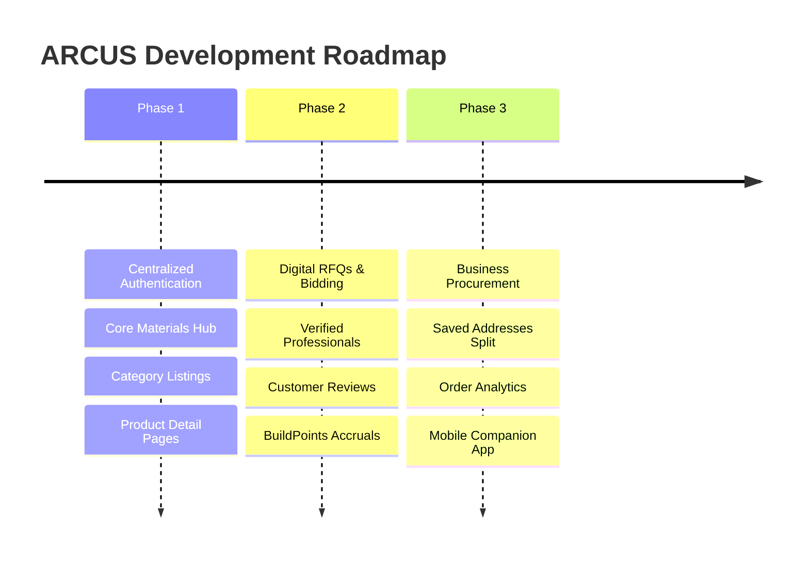

# 🏗️ ARCUS

<p align="center">
  
</p>

<p align="center">
  <strong>Build Faster. Procure Smarter. Deliver Better.</strong>
</p>

<p align="center">
  ARCUS is a full-stack, enterprise-grade construction commerce platform that enables builders and individual property developers to procure building materials, hire verified professionals, submit Request for Quotes (RFQs), and manage project schedules from a single, unified ecosystem.
</p>

<p align="center">
  
  
  
</p>

---

## 🗺️ Quick Navigation

<p align="center">
  <a href="#-platform-overview">
    
  </a>
  <a href="#-module-status-dashboard">
    
  </a>
  <a href="#-system-architecture">
    
  </a>
  <a href="#-deployment--installation">
    
  </a>
  <a href="#-roadmap">
    
  </a>
  <a href="#-documentation-hub">
    
  </a>
  <a href="#-security">
    
  </a>
</p>

---

## 🔍 Platform Overview

The ARCUS platform is designed to digitize the construction ecosystem:
- **Materials Marketplace**: Buy materials (cement, steel, CPVC fittings) with dynamic cart modifiers, dimensional metrics, and role-based pricing.
- **Services Directory**: Select and hire verified professionals (Plumbers, Electricians, Carpenters, Painters, Architects) with starting rates and reviews.
- **RFQ System**: Create detailed project lists to receive and review dynamic supplier quotes.
- **Loyalty Program**: Earn and redeem BuildPoints for checkout coupons (`WELCOME5` for B2C, `ARCUS10` for B2B).

---

## 📊 Module Status Dashboard

### Authentication & OTP
Status: 🟡 In Progress
Implemented Features:
* 2-Step OTP Verification Flow (dispatching mock 6-digit codes to Express console log).
* Secure registration & login APIs for B2C, B2B, and Professionals.
* Timer cleanup logic (`redirectTimerRef` unmount handler) preventing redirects from breaking other screens.
* Session management using JWT signatures on headers.
* Basic client/server role validation (Individual, Business, Professional, Admin).
* Bypass test code support (`123456`) in dev environments.
Missing Features:
* Social Login OAuth integration (currently Google and LinkedIn buttons show client alerts only).
* Direct verification email dispatch (currently mocks OTP to server console logs, no active SMTP integration).
* Database password reset functionality (forgot password step mocks transitions without modifying stored user hashes).
Future Enhancements:
* Support for biometric verification (WebAuthn/Passkeys).
* Add two-factor authentication (2FA) via authenticator apps (TOTP).
* Integrate password strength checker in real-time UI.
Priority: Critical

### Materials Marketplace
Status: 🟢 Ready
Implemented Features:
* Dynamic hierarchical catalog categories, subcategories, and leaf levels list.
* Keyword product search based on title.
* Interactive Product Detail Page (PDP) displaying CPVC dimensional schedules, specifications, and client reviews.
* Brand Directory Hub filtering items by manufacturer.
* Basic cart operations (quantity modification, additions, and local state persistence).
Missing Features:
* Advanced side-filter panel (no dynamic sorting or filtering by technical properties like grade, diameter, color).
* Related products recommendations section on PDP.
* Product bundles (e.g. CPVC pipe kit + CPVC adhesive glue bundle packages).
* Live inventory management (items have static mock counts, no actual vendor stock sync).
Future Enhancements:
* Real-time price tracking graphs showing trends of steel and cement.
* Integrated barcode scanner for bulk yard inventory matching.
Priority: High

### Services Marketplace
Status: 🟢 Ready
Implemented Features:
* Trades categorization (Plumbing, Electrical, Carpentry, Painting, Civil, Architecture, Interior Design).
* Professional profile views with contractor ratings, starting rates, and covered regions.
* Booking quote submission forms.
* Ratings and review score logs displays.
Missing Features:
* Direct messaging / chat module between builders and professionals.
* Calendar and scheduling system (booking inputs a text date without checking contractor calendar availability).
* Portfolio media uploading (currently professionals can only write text URLs).
Future Enhancements:
* Integrated escrow payments system for service contract milestones.
* Geolocation matching to suggest contractors closest to the project coordinates.
Priority: High

### RFQ Engine
Status: 🟡 In Progress
Implemented Features:
* RFQ submission form capturing contact, quantities, delivery locations, and details.
* Automated supplier bids simulator in the user dashboard.
* RFQ list tracker displaying posted dates and materials list.
Missing Features:
* Direct supplier bidding workspace (suppliers cannot log in to place manual bids).
* Quote side-by-side comparison tables with export options.
* RFQ status notifications (SMS or email alerts when new bids are received).
Future Enhancements:
* Automate reverse auction schedules for bulk purchases.
Priority: High

### BuildPoints & Loyalty Engine
Status: 🔴 Not Started
Implemented Features:
* Dashboard loyalty overview displaying current BuildPoints balance.
* Role-based checkout discount validations (Redeems coupon code `WELCOME5` for B2C, `ARCUS10` for B2B).
Missing Features:
* Automatic point calculation on orders (order placement does not dynamically increment points balance in database).
* Monthly accelerators or multipliers for high-volume purchases.
* Referral rewards programs.
* Tiered upgrades (Silver, Gold, Platinum benefits) based on spending history.
Future Enhancements:
* Partner store point redemptions.
Priority: Medium

### Procurement Dashboard
Status: 🟢 Ready
Implemented Features:
* Comprehensive order histories listing products, quantities, tax breakdowns, and addresses.
* Suburb-preserving street address split parser.
* Billing same as shipping address forms toggle.
* Tax invoice rendering with verified GSTIN numbers.
Missing Features:
* Spend analytics visualization (spend charts, monthly cost analytics graphs).
* PDF receipt and tax invoice downloader.
* Saved suppliers listings.
* Saved/favorite products listing.
Future Enhancements:
* Purchase requisition authorization flows (multi-level company approvals).
Priority: High

### Admin Panel
Status: 🟡 In Progress
Implemented Features:
* Master user registry showing registration list, roles, and verification flags.
* Global transactional logs audit view.
* Custom database cleanup endpoints for testing.
Missing Features:
* CRUD interface for product inventory catalog management.
* Category tree and brand mappings control panel.
* Vendor applications and profile verification dashboard.
* Active RFQ list inspection controls.
Future Enhancements:
* Export platform audit logs in Excel/CSV formats.
Priority: Medium

### Analytics Console
Status: 🔴 Not Started
Implemented Features:
* Placeholder navigation links.
Missing Features:
* All analytics dashboard components (graphs, data grids).
* Materials consumption volume forecasting.
* Automated project cost estimates.
Future Enhancements:
* Generative AI analytics summary reports of site spending.
Priority: Low

### Checkout & Address Management System
Status: 🟢 Ready
Implemented Features:
* Storing shipping and billing addresses in user profiles.
* Suburb-retaining address components parser.
* Billing address check toggles.
* Auto-filling shipping and billing fields on selection.
Missing Features:
* Address geolocation lookup using Maps API.
* Address validation checks against postal directories.
Future Enhancements:
* Direct pin drop mapping coordinates tool.
Priority: High

### Security & Validation Layer
Status: 🟢 Ready
Implemented Features:
* Centralized input validators for Indian phone numbers, emails, PIN codes, GSTINs, and password complexity.
* SQL injection scanner removing query syntax keywords.
* XSS scrubber removing HTML script tags.
* Express API rate limiters restricting auth, profile, and registration dispatches.
Missing Features:
* Parametrized SQL query protection (local DB uses JSON strings, not ORMs).
* Permanent IP blacklist bans (rate limiters reset on server restart).
Future Enhancements:
* Audit logs tracking all blocks triggered by the security middleware.
Priority: Critical

### Technical Resources & Calculators Hub
Status: 🟢 Ready
Implemented Features:
* Slab Concrete Cement Calculator converting area and slab thickness to bag and material volumes.
* Steel Weight Reinforcement Calculator based on bar diameters and lengths.
* Technical building checklists and standards guides.
Missing Features:
* Interactive structural load estimators.
* Project estimations summary exports.
Future Enhancements:
* Save calculator estimate logs directly to the user's project board.
Priority: Medium

---

## 🧬 Component Mind Map

```mermaid
graph TD
    A[ARCUS Platform] --> B[Materials Hub]
    A --> C[Services Hub]
    A --> D[Users & Profiles]
    A --> E[Orders & Checkout]
    A --> F[RFQ Engine]
    A --> G[BuildPoints Loyalty]
    A --> H[Authentication]
    A --> I[Admin Controls]

    B --> B1[Product Search]
    B --> B2[Category Tree]
    B --> B3[Dimension Variants]

    C --> C1[Contractor Lists]
    C --> C2[Ratings Logs]
    C --> C3[Booking Forms]

    D --> D1[Individual B2C]
    D --> D2[Business B2B]
    D --> D3[Professional Contractor]

    E --> E1[Address Split Parser]
    E --> E2[Billing Address Toggle]
    E --> E3[Coupons Engine]

    F --> F1[RFQ Submissions]
    F --> F2[Bids Simulator]

    G --> G1[Purchase Accruals]
    G --> G2[WELCOME5 / ARCUS10]

    H --> H1[6-digit OTP Validator]
    H --> H2[Timer Cleanup Ref]

    I --> I1[Tax Registration Audit]
    I --> I2[Vendor Status Controls]
```



---

## 🎨 System Architecture



---

## 🔄 User Journey Flowcharts

### 1. Product Purchase Journey


### 2. Professional Booking Journey


### 3. RFQ Submission Journey


---

## 📂 Project Structure

```
├── docs/                      # Technical design documents and assets
│   ├── assets/                # Logos and hero media files
│   └── screenshots/           # Screenshot gallery of main views
├── public/                    # Global public folder assets and imagery
├── server/                    # Express Node.js application
│   ├── data/                  # Local database directory (db.json)
│   └── src/                   # Server API routes and controllers
├── shared/                    # Commmon shared validation layer
└── src/                       # React TypeScript Single Page Application
    ├── components/            # Interface views, components, and widgets
    ├── context/               # Global state contexts (Auth, Cart)
    └── index.css              # Custom HSL design tokens and styles
```

---

## 🏁 Roadmap



---

## 🖼️ Screenshot Gallery

| Homepage | Materials Hub | Product Detail |
| :---: | :---: | :---: |
|  |  |  |

---

## 📖 Documentation Hub

Access specific modules and platform rules:

| Document | Location | Purpose |
| :--- | :--- | :--- |
| **System Architecture** | [`docs/architecture.md`](file:///d:/Claude%20Code/Arcus/docs/architecture.md) | Deeper dive into the frontend routing and middleware flow. |
| **Security Standards** | [`docs/security.md`](file:///d:/Claude%20Code/Arcus/docs/security.md) | Explains input sanitization rules, rate-limit logs, and JWT signatures. |
| **Database Schema** | [`docs/database-schema.md`](file:///d:/Claude%20Code/Arcus/docs/database-schema.md) | Details type definitions for Users, OTPs, RFQs, and Orders. |
| **API Specification** | [`docs/api-specification.md`](file:///d:/Claude%20Code/Arcus/docs/api-specification.md) | Full endpoint listings, status codes, and payloads. |
| **Deployment Specifications** | [`docs/deployment.md`](file:///d:/Claude%20Code/Arcus/docs/deployment.md) | Environment setup guides and startup commands. |
| **Design System** | [`docs/design-system.md`](file:///d:/Claude%20Code/Arcus/docs/design-system.md) | Outlines colors systems, typography, and transition styles. |
| **Validation Rules** | [`docs/validation-rules.md`](file:///d:/Claude%20Code/Arcus/docs/validation-rules.md) | Explains phone normalization and GSTIN structure constraints. |
| **Authentication Flow** | [`docs/authentication.md`](file:///d:/Claude%20Code/Arcus/docs/authentication.md) | Sequence diagram and detail logs for the OTP verification model. |
| **Loyalty Program** | [`docs/loyalty-program.md`](file:///d:/Claude%20Code/Arcus/docs/loyalty-program.md) | Rules and accrual ratios of the BuildPoints system. |
| **Project Roadmap** | [`docs/roadmap.md`](file:///d:/Claude%20Code/Arcus/docs/roadmap.md) | Displays developmental milestones and timelines. |

---

## 🛡️ Security

Security and validation details are kept in separate document files:
- Validation specs: [`docs/validation-rules.md`](file:///d:/Claude%20Code/Arcus/docs/validation-rules.md)
- Authentication rules: [`docs/authentication.md`](file:///d:/Claude%20Code/Arcus/docs/authentication.md)
- Rate limiting and XSS: [`docs/security.md`](file:///d:/Claude%20Code/Arcus/docs/security.md)

---

## ⚙️ Deployment & Installation

<details>
<summary><b>🛠️ Environment Variables</b></summary>

Create a `.env` file under the `server/` directory:
```ini
PORT=5000
NODE_ENV=development
```
</details>

<details>
<summary><b>🚀 Running Locally</b></summary>

#### 1. Start the API Backend Server
```bash
cd server
npm install
npm run dev
```
The backend server runs on `http://localhost:5000`.

#### 2. Start the Frontend Client
```bash
# From root directory
npm install
npm run dev
```
The client runs on `http://localhost:5173`.
</details>

<details>
<summary><b>🩺 Troubleshooting & Dev Notes</b></summary>

- **OTP Bypass**: In development, you can use the bypass verification code `123456`.
- **Nodemon Reset loop**: Database updates on `db.json` do not restart the server due to ignoring patterns in `server/nodemon.json`.
</details>

<details>
<summary><b>🧪 Testing Specifications</b></summary>

- All E2E test suites reside under the `tests/` directory.
- Run the tests using `npx playwright test`.
- To run specific tests, use `npx playwright test tests/checkout.spec.ts`.
</details>
