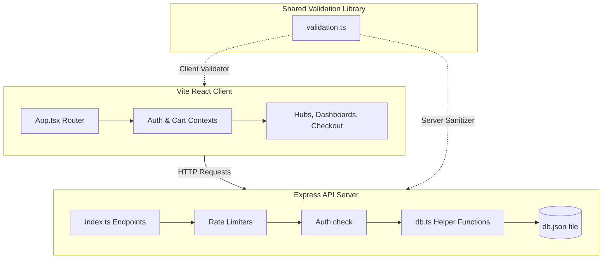
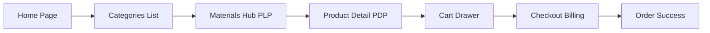
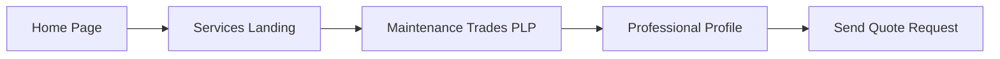
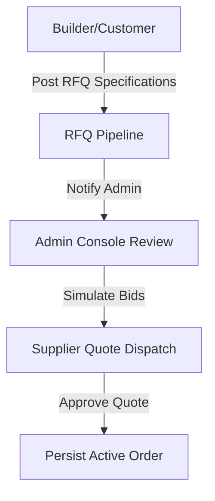
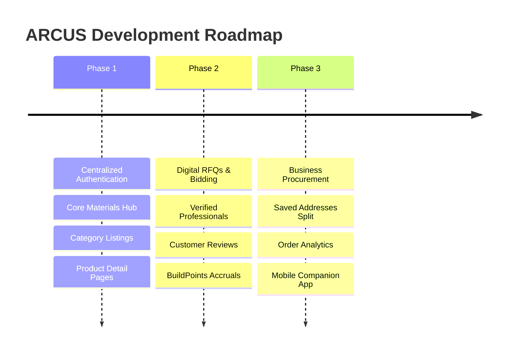

# 🏗️ ARCUS

<p align="center">
  
</p>

<p align="center">
  <strong>Build Faster. Procure Smarter. Deliver Better.</strong>
</p>

<p align="center">
  ARCUS is a full-stack, enterprise-grade construction commerce platform that enables builders and individual property developers to procure building materials, hire verified professionals, submit Request for Quotes (RFQs), and manage project schedules from a single, unified ecosystem.
</p>

<p align="center">
  
  
  
</p>

---

## 🗺️ Quick Navigation

<p align="center">
  <a href="#-platform-overview">
    
  </a>
  <a href="#-module-status-dashboard">
    
  </a>
  <a href="#-system-architecture">
    
  </a>
  <a href="#-deployment--installation">
    
  </a>
  <a href="#-roadmap">
    
  </a>
  <a href="#-documentation-hub">
    
  </a>
  <a href="#-security">
    
  </a>
</p>

---

## 🔍 Platform Overview

The ARCUS platform is designed to digitize the construction ecosystem:
- **Materials Marketplace**: Buy materials (cement, steel, CPVC fittings) with dynamic cart modifiers, dimensional metrics, and role-based pricing.
- **Services Directory**: Select and hire verified professionals (Plumbers, Electricians, Carpenters, Painters, Architects) with starting rates and reviews.
- **RFQ System**: Create detailed project lists to receive and review dynamic supplier quotes.
- **Loyalty Program**: Earn and redeem BuildPoints for checkout coupons (`WELCOME5` for B2C, `ARCUS10` for B2B).

---

## 📊 Module Status Dashboard

Below is the living product roadmap and implementation status tracker for all ARCUS subsystems. 

| Module | Frontend | Backend | Database | Implemented Features | Missing Features | Future Enhancements | Priority |
| :--- | :---: | :---: | :---: | :--- | :--- | :--- | :---: |
| **Authentication & OTP** | 🟡 In Progress | 🟡 In Progress | 🟢 Ready | • Login & Registration views<br/>• 6-digit OTP verification panel<br/>• Unmount timer ref cleanup<br/>• Session token storage | • Social logins (Google/LinkedIn)<br/>• Real SMTP email delivery<br/>• Active DB password reset | • Passkey biometric logins<br/>• Authenticator App 2FA | **Critical** |
| **Materials Marketplace** | 🟡 In Progress | 🟡 In Progress | 🟢 Ready | • Hierarchical category browser<br/>• Product keyword search<br/>• PDP details and specifications<br/>• Brand directories | • Multi-criteria side-filters<br/>• Related products recommendations<br/>• Product kits & bundles<br/>• Real vendor inventory sync | • Real-time price tracking graphs<br/>• Barcode scanner product matcher | **High** |
| **Services Marketplace** | 🟢 Ready | 🟡 In Progress | 🟢 Ready | • Contractor trade categories<br/>• Profile listings and locations<br/>• Quote booking request forms<br/>• Ratings and reviews display | • Live customer-vendor chat<br/>• Contractor calendar scheduling<br/>• Portfolio media uploaders | • Milestone escrow payments<br/>• Nearby contractor geo-matching | **High** |
| **RFQ Engine** | 🟡 In Progress | 🟡 In Progress | 🟢 Ready | • RFQ creation & posting form<br/>• Bid simulator for dashboard<br/>• RFQ active tracking logs | • Supplier portal bidding forms<br/>• Side-by-side quote comparisons<br/>• SMS/Email bid notifications | • Multi-round reverse auctions | **High** |
| **BuildPoints & Loyalty** | 🟢 Ready | 🔴 Not Started | 🔴 Not Started | • Dashboard loyalty point balance<br/>• Retail/B2B coupons validation | • Post-order point increment triggers<br/>• Monthly multipliers<br/>• Tier status upgrades (Gold/Platinum) | • Partner store point redemptions | **Medium** |
| **Procurement Dashboard** | 🟢 Ready | 🟡 In Progress | 🟢 Ready | • Order histories details view<br/>• Address split auto-fill parser<br/>• Billing address check toggling<br/>• Verified GSTIN rendering | • Monthly spend charts & graphs<br/>• PDF invoice/receipt downloads<br/>• Saved/favorite products listing | • Corporate multi-level approval flow | **High** |
| **Admin Panel** | 🟡 In Progress | 🟡 In Progress | 🟢 Ready | • Master user list grid view<br/>• Global transaction log audits<br/>• Database cleanup APIs for dev | • Product catalog CRUD manager<br/>• Category tree management view<br/>• Vendor applications auditor | • CSV/Excel transaction exports | **Medium** |
| **Analytics Console** | 🔴 Not Started | 🔴 Not Started | 🔴 Not Started | • Navigation placeholder tabs | • Spend dashboards & analytics grids<br/>• Cement/Steel forecasting logic<br/>• Automated cost estimators | • AI-driven procurement advice | **Low** |
| **Checkout & Address** | 🟢 Ready | 🟢 Ready | 🟢 Ready | • Address profile management<br/>• Suburb-retaining address parser<br/>• Billing address forms toggles | • Address maps geolocation check<br/>• Address validation checks | • Google Maps pin drop selector | **High** |
| **Security & Validation** | 🟢 Ready | 🟢 Ready | 🟢 Ready | • Centralized phone/email/GSTIN checks<br/>• XSS HTML script scrubbers<br/>• SQL injection keyword scrubbers<br/>• Auth & profile rate limiters | • DB parameterized query binds<br/>• Permanent IP blacklist bans | • Security audit alert log tracker | **Critical** |
| **Resources & Calculators** | 🟢 Ready | 🟢 Ready | 🟢 Ready | • Concrete volume cement estimator<br/>• Steel bar reinforcement calculator<br/>• Quality audit checklists | • Structural load calculators<br/>• Estimate logs export options | • Save calculations to projects board | **Medium** |

---

## 🧬 Component Mind Map

```mermaid
graph TD
    A[ARCUS Platform] --> B[Materials Hub]
    A --> C[Services Hub]
    A --> D[Users & Profiles]
    A --> E[Orders & Checkout]
    A --> F[RFQ Engine]
    A --> G[BuildPoints Loyalty]
    A --> H[Authentication]
    A --> I[Admin Controls]

    B --> B1[Product Search]
    B --> B2[Category Tree]
    B --> B3[Dimension Variants]

    C --> C1[Contractor Lists]
    C --> C2[Ratings Logs]
    C --> C3[Booking Forms]

    D --> D1[Individual B2C]
    D --> D2[Business B2B]
    D --> D3[Professional Contractor]

    E --> E1[Address Split Parser]
    E --> E2[Billing Address Toggle]
    E --> E3[Coupons Engine]

    F --> F1[RFQ Submissions]
    F --> F2[Bids Simulator]

    G --> G1[Purchase Accruals]
    G --> G2[WELCOME5 / ARCUS10]

    H --> H1[6-digit OTP Validator]
    H --> H2[Timer Cleanup Ref]

    I --> I1[Tax Registration Audit]
    I --> I2[Vendor Status Controls]
```



---

## 🎨 System Architecture



---

## 🔄 User Journey Flowcharts

### 1. Product Purchase Journey


### 2. Professional Booking Journey


### 3. RFQ Submission Journey


---

## 📂 Project Structure

```
├── docs/                      # Technical design documents and assets
│   ├── assets/                # Logos and hero media files
│   └── screenshots/           # Screenshot gallery of main views
├── public/                    # Global public folder assets and imagery
├── server/                    # Express Node.js application
│   ├── data/                  # Local database directory (db.json)
│   └── src/                   # Server API routes and controllers
├── shared/                    # Commmon shared validation layer
└── src/                       # React TypeScript Single Page Application
    ├── components/            # Interface views, components, and widgets
    ├── context/               # Global state contexts (Auth, Cart)
    └── index.css              # Custom HSL design tokens and styles
```

---

## 🏁 Roadmap



---

## 🖼️ Screenshot Gallery

| Homepage | Materials Hub | Product Detail |
| :---: | :---: | :---: |
|  |  |  |

---

## 📖 Documentation Hub

Access specific modules and platform rules:

| Document | Location | Purpose |
| :--- | :--- | :--- |
| **System Architecture** | [`docs/architecture.md`](file:///d:/Claude%20Code/Arcus/docs/architecture.md) | Deeper dive into the frontend routing and middleware flow. |
| **Security Standards** | [`docs/security.md`](file:///d:/Claude%20Code/Arcus/docs/security.md) | Explains input sanitization rules, rate-limit logs, and JWT signatures. |
| **Database Schema** | [`docs/database-schema.md`](file:///d:/Claude%20Code/Arcus/docs/database-schema.md) | Details type definitions for Users, OTPs, RFQs, and Orders. |
| **API Specification** | [`docs/api-specification.md`](file:///d:/Claude%20Code/Arcus/docs/api-specification.md) | Full endpoint listings, status codes, and payloads. |
| **Deployment Specifications** | [`docs/deployment.md`](file:///d:/Claude%20Code/Arcus/docs/deployment.md) | Environment setup guides and startup commands. |
| **Design System** | [`docs/design-system.md`](file:///d:/Claude%20Code/Arcus/docs/design-system.md) | Outlines colors systems, typography, and transition styles. |
| **Validation Rules** | [`docs/validation-rules.md`](file:///d:/Claude%20Code/Arcus/docs/validation-rules.md) | Explains phone normalization and GSTIN structure constraints. |
| **Authentication Flow** | [`docs/authentication.md`](file:///d:/Claude%20Code/Arcus/docs/authentication.md) | Sequence diagram and detail logs for the OTP verification model. |
| **Loyalty Program** | [`docs/loyalty-program.md`](file:///d:/Claude%20Code/Arcus/docs/loyalty-program.md) | Rules and accrual ratios of the BuildPoints system. |
| **Project Roadmap** | [`docs/roadmap.md`](file:///d:/Claude%20Code/Arcus/docs/roadmap.md) | Displays developmental milestones and timelines. |

---

## 🛡️ Security

Security and validation details are kept in separate document files:
- Validation specs: [`docs/validation-rules.md`](file:///d:/Claude%20Code/Arcus/docs/validation-rules.md)
- Authentication rules: [`docs/authentication.md`](file:///d:/Claude%20Code/Arcus/docs/authentication.md)
- Rate limiting and XSS: [`docs/security.md`](file:///d:/Claude%20Code/Arcus/docs/security.md)

---

## ⚙️ Deployment & Installation

<details>
<summary><b>🛠️ Environment Variables</b></summary>

Create a `.env` file under the `server/` directory:
```ini
PORT=5000
NODE_ENV=development
```
</details>

<details>
<summary><b>🚀 Running Locally</b></summary>

#### 1. Start the API Backend Server
```bash
cd server
npm install
npm run dev
```
The backend server runs on `http://localhost:5000`.

#### 2. Start the Frontend Client
```bash
# From root directory
npm install
npm run dev
```
The client runs on `http://localhost:5173`.
</details>

<details>
<summary><b>🩺 Troubleshooting & Dev Notes</b></summary>

- **OTP Bypass**: In development, you can use the bypass verification code `123456`.
- **Nodemon Reset loop**: Database updates on `db.json` do not restart the server due to ignoring patterns in `server/nodemon.json`.
</details>

<details>
<summary><b>🧪 Testing Specifications</b></summary>

- All E2E test suites reside under the `tests/` directory.
- Run the tests using `npx playwright test`.
- To run specific tests, use `npx playwright test tests/checkout.spec.ts`.
</details>
