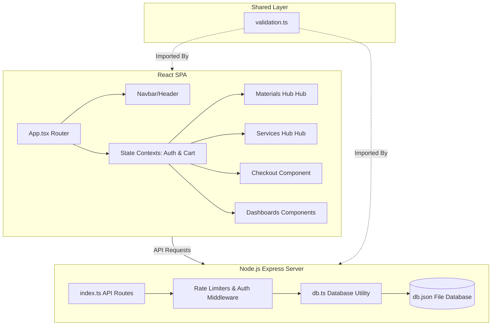

# 🏛️ ARCUS System Architecture

ARCUS is designed as a decoupled, full-stack monorepo web application that combines a client-side Single Page Application (SPA) with a lightweight, secure REST API backend.

## 🏗️ Structural Overview

---

## 💻 Frontend Client Architecture
- **Single Page Routing**: ARCUS implements a lightweight, hash-based client router in `src/App.tsx` that listens to `window.location.hash` changes. Segment parsing automatically maps slugs into component props (e.g. category, subcategory, leaf product parameters).
- **State Management Contexts**:
  - `AuthContext`: Tracks user session state, handles login, registers clients, triggers OTP verification overlays, and caches user roles.
  - `CartContext`: Manages in-memory shopping cart states (quantities, addition, removal, updates, and persistence).
- **Layout Styling**: Stylized using a pure design token system with harmonized CSS HSL parameters, smooth animations, and glassmorphism.

---

## 📡 Backend API Architecture
- **RESTful Endpoints**: Built with Express and Node.js.
- **Middleware Pipeline**:
  - CORS configurations.
  - Express JSON body parsers with payload limiters.
  - Custom rate-limiting middleware instances for authentication, profile updates, and registration submissions.
- **Data Utility Layer (`db.ts`)**: Integrates helper functions that read, write, update, and search records stored in the JSON file database (`server/data/db.json`).
