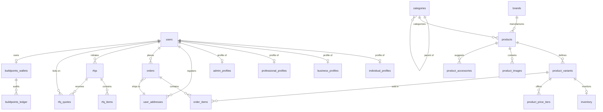

# Chapter 9: Database Documentation & Schema Dictionary

---
◀️ **[Previous](ERD.md)** | 🔼 **[Parent Section](../README.md)** | **[Next](MODULES.md)** ▶️
---

ARCUS implements a fully normalized relational schema, moving away from legacy flat-file structures. In development, if PostgreSQL is not active, the backend uses a local JSON fallback (`db.json`) modeled to match this database design.

### Entity Relationship Diagram (ERD)

---

### Database Data Dictionary

#### 1. Table: `users`
Tracks core user credentials and roles.
* **`id`** (VARCHAR(50), PK): Stripe-style unique identifier (e.g. `user_...`).
* **`email`** (VARCHAR(100), Unique, Not Null): Lowercase, validated email.
* **`phone`** (VARCHAR(50), Unique, Not Null): Verified 10-digit mobile number.
* **`password_hash`** (VARCHAR(256), Not Null): Argon2 or PBKDF2 password hash.
* **`password_salt`** (VARCHAR(256), Not Null): Cryptographic salt.
* **`role`** (VARCHAR(50), Not Null): System-wide role (`'USER'`, `'ADMIN'`).
* **`customer_type`** (VARCHAR(50), Default `'INDIVIDUAL'`): Maps to profile type (`'INDIVIDUAL'`, `'BUSINESS'`, `'PROFESSIONAL'`).
* **`admin_role`** (VARCHAR(100), Default `'SUPER_ADMIN'`): Scope for administrator accounts.
* **`email_verified`** (BOOLEAN, Default `FALSE`): Verification status.
* **`created_at`** (TIMESTAMPTZ, Default `NOW()`): Registration timestamp.
* **`updated_at`** (TIMESTAMPTZ, Default `NOW()`): Last profile update.
* **Constraints**:
  * `users_phone_unique`: Unique constraint on `phone`.

#### 2. Table: `individual_profiles`
B2C personal details.
* **`user_id`** (VARCHAR(50), PK, FK → `users.id` ON DELETE CASCADE): References the core user account.
* **`full_name`** (VARCHAR(100), Not Null): Customer's name.
* **`alternate_phone`** (VARCHAR(50)): Secondary phone number.
* **`preferred_language`** (VARCHAR(50), Default `'English'`): Preferred support language.
* **`created_at` / `updated_at`** (TIMESTAMPTZ, Default `NOW()`).

#### 3. Table: `business_profiles`
B2B company metadata and tax details.
* **`user_id`** (VARCHAR(50), PK, FK → `users.id` ON DELETE CASCADE): References the core user.
* **`company_name`** (VARCHAR(150), Not Null): Registered trade name.
* **`gst_number`** (VARCHAR(50), Not Null): Indian Tax Identifier (GSTIN).
* **`pan_number`** (VARCHAR(10)): Income Tax Account Number.
* **`trade_license_url`** (VARCHAR(255)): URL to verification documents.
* **`verification_status`** (ENUM `verification_status_enum`, Default `'PENDING'`): Portal verification status (`'PENDING'`, `'APPROVED'`, `'REJECTED'`).
* **`verified_at`** (TIMESTAMPTZ): Specifying when B2B account was validated.
* **`verified_by`** (VARCHAR(50), FK → `users.id`): Administrator who approved.
* **Indexes**:
  * `idx_business_gst_unique`: Unique index on `UPPER(gst_number)`.

#### 4. Table: `professional_profiles`
Trade specialization listings for subcontractors.
* **`user_id`** (VARCHAR(50), PK, FK → `users.id` ON DELETE CASCADE).
* **`business_profile_id`** (VARCHAR(50), FK → `users.id` ON DELETE SET NULL): Optional link to business profile if incorporated.
* **`service_category`** (VARCHAR(100), Not Null): Trade category (e.g. Plumbing, Electrical).
* **`experience_years`** (INTEGER, Default `0`): Years in trade.
* **`city` / `state`** (VARCHAR(100), Not Null): Service area.
* **`website_url` / `portfolio_url`** (VARCHAR(150)).
* **`bio`** (TEXT): Professional bio.
* **`skills`** (JSONB, Default `'[]'`): Specific skills array (e.g. `["Electrician", "Concealed Wiring"]`).
* **`average_rating`** (NUMERIC(3,2), Default `0.00`): Average review score.
* **`review_count`** (INTEGER, Default `0`).
* **`verification_status`** (ENUM `verification_status_enum`, Default `'PENDING'`).
* **Indexes**:
  * `idx_professional_category`: Index on `service_category`.
  * `idx_professional_location`: Composite index on `(state, city)`.

#### 5. Table: `admin_profiles`
Scopes for administrator accounts.
* **`user_id`** (VARCHAR(50), PK, FK → `users.id` ON DELETE CASCADE).
* **`admin_role`** (ENUM `admin_role_enum`, Default `'SUPER_ADMIN'`): Scope (`'SUPER_ADMIN'`, `'OPERATIONS_MANAGER'`, `'INVENTORY_MANAGER'`, `'SALES_MANAGER'`, `'CUSTOMER_SUPPORT'`).
* **`permissions`** (JSONB, Default `'[]'`): Permissions array override.
* **`assigned_departments`** (JSONB, Default `'[]'`).

#### 6. Table: `user_addresses`
Standardized address records for users.
* **`id`** (VARCHAR(50), PK): Address identifier (`addr_...`).
* **`user_id`** (VARCHAR(50), Not Null, FK → `users.id` ON DELETE CASCADE).
* **`address_type`** (ENUM `address_type_enum`, Default `'SHIPPING'`): `'SHIPPING'`, `'BILLING'`, or `'BOTH'`.
* **`recipient_name`** (VARCHAR(100), Not Null): Delivery contact name.
* **`phone_number`** (VARCHAR(50), Not Null): Delivery contact number.
* **`company_name`** (VARCHAR(150)): Optional company name.
* **`address_line_1`** (TEXT, Not Null): Street address.
* **`address_line_2`** (TEXT): Landmark or suite number.
* **`city` / `state`** (VARCHAR(100), Not Null).
* **`postal_code`** (VARCHAR(20), Not Null): PIN code.
* **`is_default`** (BOOLEAN, Default `FALSE`).
* **Indexes**:
  * `idx_addresses_user`: Index on `user_id`.

#### 7. Table: `categories`
Hierarchical category tree.
* **`id`** (VARCHAR(50), PK): Category identifier (e.g. `plumbing`).
* **`name`** (VARCHAR(100), Not Null): Category name.
* **`slug`** (VARCHAR(100), Unique): Category URL slug.
* **`icon`** (VARCHAR(50)): Material Symbol icon.
* **`parent_id`** (VARCHAR(50), FK → `categories.id`): Parent category for nested hierarchy.

#### 8. Table: `products`
Description and default parameters for products.
* **`id`** (VARCHAR(50), PK): Product identifier (`prod_...`).
* **`brand_id`** (VARCHAR(50), FK → `brands.id`): Product manufacturer.
* **`leaf_category_id`** (VARCHAR(50), FK → `categories.id`): Specific leaf node category.
* **`name`** (VARCHAR(150), Not Null): Product name.
* **`description`** (TEXT): Detailed product description.
* **`gst_rate`** (NUMERIC(5,2), Default `18.00`): Default GST rate percentage.
* **`rating`** (NUMERIC(2,1), Default `0.0`): Product rating score.
* **`link`** (VARCHAR(255), Unique): Product detail page slug.
* **Constraints**:
  * `products_rating_check`: CHECK `(rating >= 0.0 AND rating <= 5.0)`.

#### 9. Table: `product_variants`
SKUs for product variations (dimensions, packaging, price).
* **`id`** (VARCHAR(50), PK): SKU variant identifier (`var_...`).
* **`product_id`** (VARCHAR(50), Not Null, FK → `products.id` ON DELETE CASCADE).
* **`sku`** (VARCHAR(100), Unique, Not Null): Stock keeping unit.
* **`name`** (VARCHAR(150), Not Null): Variant specific name.
* **`attributes`** (JSONB, Default `'{}'`): Key-value pair of variant specs (size, color, class).
* **`price`** (NUMERIC(12,2), Not Null): Base price per unit (exclusive of taxes).
* **`procurement_price`** (NUMERIC(12,2)): Supplier cost (restricted to Admin roles).
* **`unit_of_measure`** (VARCHAR(50), Default `'Piece'`): Unit type (e.g. Bag, Bundle, Meter).
* **`minimum_order_quantity`** (INTEGER, Default `1`): MOQ for this variant.
* **`order_multiple`** (INTEGER, Default `1`): Quantities must match multiples of this value.
* **`status`** (ENUM `product_status_enum`, Default `'ACTIVE'`).
* **Indexes**:
  * `idx_variants_product`: Index on `product_id`.

#### 10. Table: `product_price_tiers`
Volume discounts per SKU variant.
* **`id`** (SERIAL, PK): Price tier ID.
* **`variant_id`** (VARCHAR(50), Not Null, FK → `product_variants.id` ON DELETE CASCADE).
* **`min_quantity`** (INTEGER, Not Null): Minimum quantity threshold.
* **`max_quantity`** (INTEGER, Not Null): Maximum quantity threshold.
* **`price`** (NUMERIC(12,2), Not Null): Tier-specific price.
* **`discount_percentage`** (NUMERIC(5,2), Not Null).
* **Constraints**:
  * `chk_price_tiers_qty`: CHECK `(min_quantity <= max_quantity)`.
* **Indexes**:
  * `idx_tiers_variant`: Index on `variant_id`.

#### 11. Table: `inventory`
Real-time stock monitoring.
* **`variant_id`** (VARCHAR(50), PK, FK → `product_variants.id` ON DELETE CASCADE).
* **`available_stock`** (INTEGER, Default `0`, Not Null): Physical stock available.
* **`reserved_stock`** (INTEGER, Default `0`, Not Null): Stock reserved for active orders.
* **`reorder_level`** (INTEGER, Default `10`, Not Null): Reorder threshold.
* **Constraints**:
  * `chk_stock_non_negative`: CHECK `(available_stock >= 0 AND reserved_stock >= 0)`.

#### 12. Table: `orders`
Order header metadata.
* **`id`** (VARCHAR(50), PK): Order identifier (`ARC-...`).
* **`user_id`** (VARCHAR(50), Not Null, FK → `users.id` ON DELETE CASCADE).
* **`timestamp`** (TIMESTAMPTZ, Default `NOW()`).
* **`date`** (VARCHAR(50)): Formatted display date.
* **`products`** (TEXT): Summary string of products (compatibility mapping).
* **`status`** (ENUM `order_status_enum`, Default `'Pending'`): Order status (`'Pending'`, `'Confirmed'`, `'Dispatched'`, `'Out For Delivery'`, `'Delivered'`, `'Cancelled'`, `'Awaiting Payment'`).
* **`amount`** (NUMERIC(12,2), Not Null): Total order value.
* **`gst_number`** (VARCHAR(50)): GSTIN used for this invoice.
* **`payment_method`** (VARCHAR(100)): Payment method used.
* **`points_earned`** (INTEGER, Default `0`): Loyalty points earned from order.

#### 13. Table: `order_items`
Line items for orders.
* **`id`** (SERIAL, PK).
* **`order_id`** (VARCHAR(50), Not Null, FK → `orders.id` ON DELETE CASCADE).
* **`variant_id`** (VARCHAR(50), Not Null, FK → `product_variants.id` ON DELETE RESTRICT).
* **`quantity`** (INTEGER, Not Null): Number of units ordered.
* **`unit_price`** (NUMERIC(12,2), Not Null): Price per unit.
* **`gst_rate`** (NUMERIC(5,2), Default `18.00`).
* **`tax_amount`** (NUMERIC(12,2), Not Null): Calculated tax amount.
* **`total_amount`** (NUMERIC(12,2), Not Null): Line item total (quantity * price + tax).
* **Constraints**:
  * `chk_order_items_qty`: CHECK `(quantity > 0)`.
* **Indexes**:
  * `idx_order_items_order`: Index on `order_id`.
  * `idx_order_items_variant`: Index on `variant_id`.

#### 14. Table: `rfqs`
RFQ metadata and project tracking.
* **`id`** (VARCHAR(50), PK): RFQ identifier (`rfq_...`).
* **`buyer_id`** (VARCHAR(50), FK → `users.id` ON DELETE CASCADE).
* **`name`** (VARCHAR(100), Not Null): Contact name.
* **`phone`** (VARCHAR(50), Not Null): Contact phone.
* **`category`** (VARCHAR(100), Not Null): Material category required.
* **`location`** (VARCHAR(255)): Delivery location.
* **`status`** (ENUM `rfq_status_enum`, Default `'Submitted'`): RFQ status (`'Submitted'`, `'Open'`, `'Under Review'`, `'Quotes Received'`, `'Completed'`, `'Cancelled'`, `'Expired'`).
* **`title`** (VARCHAR(255)): RFQ title.
* **`budget`** (VARCHAR(100)): Budget details.
* **`attachment_urls`** (JSONB, Default `'[]'`): URLs to project drawings.

#### 15. Table: `rfq_items`
RFQ line items.
* **`id`** (VARCHAR(50), PK).
* **`rfq_id`** (VARCHAR(50), Not Null, FK → `rfqs.id` ON DELETE CASCADE).
* **`product_id`** (VARCHAR(50), FK → `products.id` ON DELETE SET NULL): Optional link to catalog.
* **`item_name`** (VARCHAR(150), Not Null): Item name/description.
* **`quantity`** (VARCHAR(100), Not Null): Required quantity and unit.
* **`specification_requirements`** (JSONB, Default `'[]'`): Detailed specifications.
* **Indexes**:
  * `idx_rfq_items_rfq`: Index on `rfq_id`.

#### 16. Table: `quotations`
Versions of quotations submitted for RFQs.
* **`id`** (VARCHAR(50), PK): Quotation ID (e.g. `QT-101-V1`).
* **`quotation_number`** (VARCHAR(50), Not Null): Grouping number (`QT-101`).
* **`version`** (INTEGER, Not Null, Default `1`): Revision number.
* **`rfq_id`** (VARCHAR(50), Not Null, FK → `rfqs.id` ON DELETE CASCADE).
* **`status`** (VARCHAR(50), Default `'SENT'`): Status (`'SENT'`, `'APPROVED'`, `'DECLINED'`, `'NEGOTIATION_REQUESTED'`).
* **`subtotal`** (NUMERIC(12,2), Not Null): Sum of line items.
* **`discount_type`** (VARCHAR(20), Default `'NONE'`): `'FLAT'`, `'PERCENT'`, or `'NONE'`.
* **`discount_value`** (NUMERIC(12,2), Default `0.00`).
* **`shipping_charges`** (NUMERIC(12,2), Default `0.00`).
* **`free_shipping`** (BOOLEAN, Default `FALSE`).
* **`gst_amount`** (NUMERIC(12,2), Not Null).
* **`grand_total`** (NUMERIC(12,2), Not Null).
* **`delivery_terms` / `payment_terms`** (TEXT).
* **`validity_date`** (DATE): Quote expiration date.
* **`notes` / `customer_comments` / `decline_reason`** (TEXT).
* **`created_by`** (VARCHAR(50), FK → `users.id`): Admin who drafted.

#### 17. Table: `buildpoints_wallets`
Loyalty program balances.
* **`user_id`** (VARCHAR(50), PK, FK → `users.id` ON DELETE CASCADE).
* **`balance`** (INTEGER, Default `0`, Not Null): Active points balance.
* **`tier`** (VARCHAR(50), Default `'BRONZE'`): Customer loyalty tier (`'BRONZE'`, `'SILVER'`, `'GOLD'`, `'PLATINUM'`).
* **`lifetime_points_accumulated`** (INTEGER, Default `0`, Not Null).
* **Constraints**:
  * `chk_balance_non_negative`: CHECK `(balance >= 0)`.

#### 18. Table: `buildpoints_ledger`
Double-entry points ledger.
* **`id`** (SERIAL, PK).
* **`wallet_user_id`** (VARCHAR(50), Not Null, FK → `buildpoints_wallets.user_id` ON DELETE CASCADE).
* **`points`** (INTEGER, Not Null): Points delta (earned positive, redeemed negative).
* **`transaction_type`** (ENUM `buildpoints_transaction_type_enum`, Not Null): `'EARNED'`, `'REDEEMED'`, `'ADJUSTED'`, or `'EXPIRED'`.
* **`reference_type`** (VARCHAR(50), Not Null): Context ('ORDER', 'ADMIN', 'BOOKING').
* **`reference_id`** (VARCHAR(50)): Associated Order ID or audit log entry.
* **Indexes**:
  * `idx_points_ledger_wallet`: Index on `wallet_user_id`.

#### 19. Table: `audit_logs`
System-wide admin logs.
* **`id`** (SERIAL, PK).
* **`action_type`** (VARCHAR(100), Not Null): Event type (e.g. `'ADJUST_STOCK'`).
* **`details`** (TEXT, Not Null): Event payload details.
* **`performed_by`** (VARCHAR(100), Not Null): Email/ID of admin.
* **`timestamp`** (TIMESTAMPTZ, Default `NOW()`).

---

---

---
◀️ **[Previous](ERD.md)** | 🔼 **[Parent Section](../README.md)** | **[Next](MODULES.md)** ▶️
