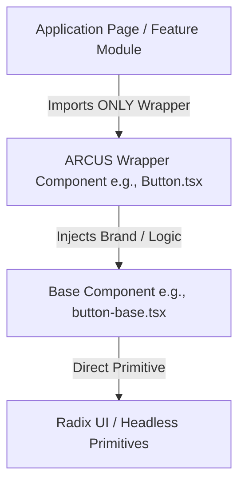

# ARCUS UI Component Architecture

This document defines the official, permanent architectural standard for UI components in the ARCUS Enterprise application. All future frontend developers must adhere strictly to these patterns.

---

## 1. Core Architectural Philosophy

To maintain maximum upgradeability and modularity, the ARCUS Design System utilizes a **Layered Wrapping Pattern**. Primitives generated by third-party tools (such as the shadcn/ui CLI) are separated from the branding, layouts, accessibility additions, and custom props used by application features.



### The Three Layers:

1. **Primitive Layer (Radix UI / Headless)**:
   * Accessible, headless interaction components (e.g. Radix dialogs, checkbox, switches, popovers).
2. **Base Component Layer (`*-base.tsx`)**:
   * Pristine code generated by the shadcn/ui CLI.
   * Focuses purely on basic styling and skeleton markup.
   * **Private to the UI directory**. No outside consumer should import a base component directly.
3. **Wrapper Component Layer (`*.tsx` - PascalCase)**:
   * The public-facing API exported to the application.
   * Injects company branding (Black & Gold theme), layouts, and accessibility hooks (focus traps, scroll locks, blur overlays).
   * Implements helper properties (e.g. `isLoading`, `error`, `helperText`, `label`, `required`).

---

## 2. Component Hierarchies

### Button Component
```
button-base.tsx (Pristine shadcn)
  └── Button.tsx (ARCUS Wrapper: adds primary, secondary, danger variants, and isLoading)
        └── Consumers (Application pages)
```

### Dialog Component
```
dialog-base.tsx (Pristine shadcn)
  └── Dialog.tsx (ARCUS Wrapper: adds backdrop blur, custom close, confirm/cancel buttons)
        └── Consumers (Application pages)
```

### Sheet & Drawer Components
To avoid maintaining multiple duplicate overlay systems, the bottom `Drawer` component is implemented as a specialized layout variant of the side `Sheet` component.
```
sheet-base.tsx (Pristine shadcn side panels)
  ├── Sheet.tsx (ARCUS Wrapper: side panels, responsive sizing)
  │     └── Consumers (Right/Left side panels)
  └── Drawer.tsx (Specialized Wrapper: sets side="bottom" and bottom-sheet dimensions)
        └── Consumers (Mobile/Bottom drawer menus)
```

---

## 3. Naming & Import Standards

* **Base Files**: Lowercase with `-base` suffix (e.g., `button-base.tsx`, `input-base.tsx`, `select-base.tsx`).
* **Wrapper Files**: PascalCase without suffixes (e.g., `Button.tsx`, `Input.tsx`, `Select.tsx`).
* **Imports**: Application features must **only** import from wrappers. Base files are private implementation details.

### ESLint Import Restrictions Rule
Base components should be private to the `src/components/ui/` folder. The following ESLint config pattern enforces this boundary:
```json
{
  "rules": {
    "no-restricted-imports": ["error", {
      "patterns": [{
        "group": ["**/ui/*-base"],
        "message": "Direct import of base component is forbidden. Import the PascalCase wrapper from '@/components/ui/*' instead."
      }]
    }]
  }
}
```

### Import Check (Mandatory Guarantee)
Search command output for base component imports outside the `src/components/ui/` folder:
```bash
grep -rn "from '.*-base'" src/ --exclude-dir=components/ui
# Target: 0 results
```
Only wrappers are allowed to import `-base` files.
