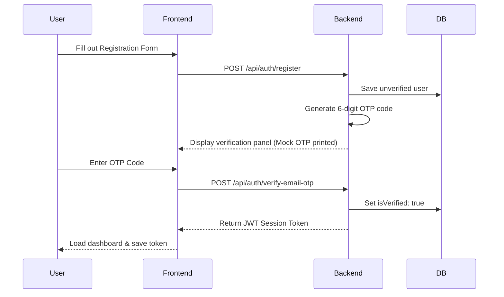

# 🔑 ARCUS Authentication Specification

ARCUS uses a secure 2-step registration and login verification model.

## 🔄 Auth Flow Mechanics

---

## 🧹 Redirect Race Condition Cleanup

To prevent redirects from interrupting subsequent pages (e.g. checkout), a `useRef` timer reference is integrated inside [`src/components/AuthPage.tsx`](file:///d:/Claude%20Code/Arcus/src/components/AuthPage.tsx):
- **Ref hook**: `const redirectTimerRef = useRef(...)`
- **Effect hook**: Clears the active timeout when `AuthPage` unmounts.
- **Redirection**: Clears previous timers before scheduling a new role-based redirection.
