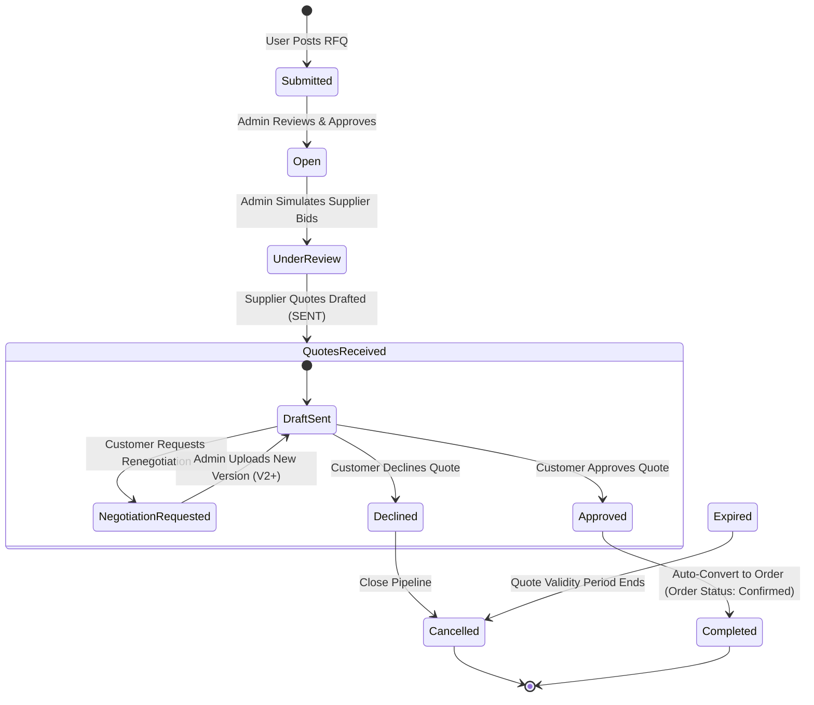
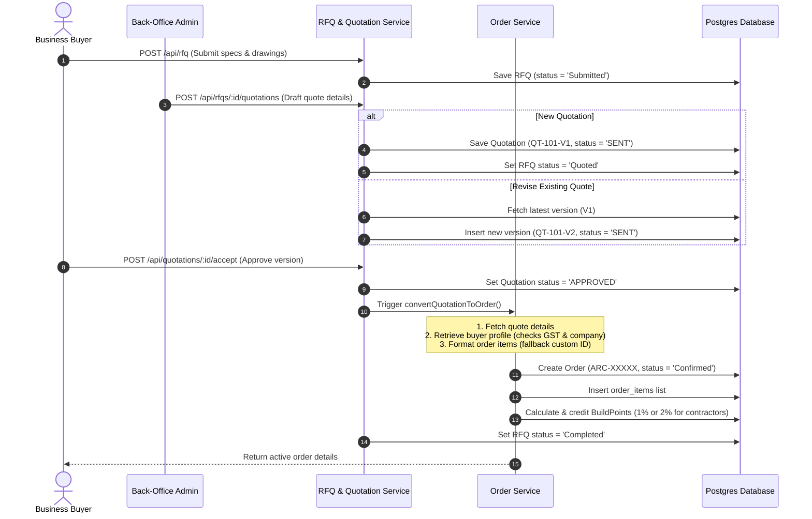

# Chapter 13: Request For Quote (RFQ) Module

---
◀️ **[Previous](BUSINESS_RULES.md)** | 🔼 **[Parent Section](../README.md)** | **[Next](QUOTATION_WORKFLOW.md)** ▶️
---

The Request for Quote (RFQ) module digitizes B2B procurement, allowing builders to submit specs, review quotes, and convert approved quotes into active orders.

### RFQ & Quotation Lifecycle

### RFQ Conversion Sequence

### Detailed RFQ Types
1. **Quick RFQ**: Submitted from the homepage widget. Requires name, phone, category, and delivery location.
2. **Inquiry RFQ**: Submitted from the Services Hub for trade quotes. Requires budget, timeline, and description.
3. **Detailed RFQ**: Submitted from the B2B portal. Requires line items, drawings uploads, and delivery details.

### Business Rules & Constraints
* **Versioning**: Quotations are versioned (e.g. `QT-101-V1`, `QT-101-V2`). Each renegotiation request increments the version, keeping previous versions in the database.
* **Conversion**: Approving a quotation automatically triggers `convertQuotationToOrder()`, creating an order with status `Confirmed` and payment method `B2B Credit`.
* **Lead Times**: Quote conversion calculates estimated delivery dates based on product variant lead times.

---

---

---

## 🧭 RFQ Visual Workflows & Sequence Diagrams

---
◀️ **[Previous](BUSINESS_RULES.md)** | 🔼 **[Parent Section](../README.md)** | **[Next](QUOTATION_WORKFLOW.md)** ▶️
