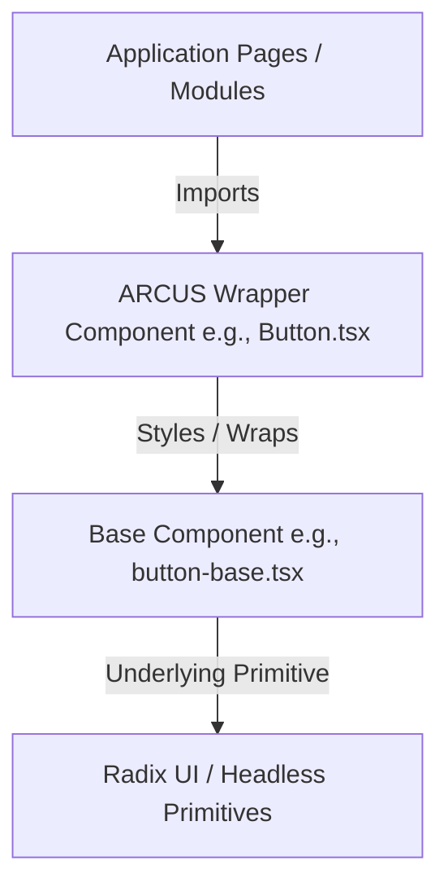

# ARCUS Design System: Component Wrapper Guidelines

This document outlines the standard architecture philosophy, naming conventions, responsibilities, and update processes for component development in the ARCUS Design System.

---

## 1. Architectural Philosophy

To ensure that the ARCUS Design System remains standard, maintainable, and easily upgradeable, we implement a **Strict Separation of Concerns** between generated base components and our custom enterprise wrappers.



By decoupling these layers, we gain two primary benefits:
1. **Upgradeable Core**: The base components (generated via shadcn/ui CLI) remain untouched. When shadcn updates its styles or accessibility handlers, we can regenerate the base files without losing ARCUS-specific features.
2. **Branded and Feature-Rich Primitives**: All company branding, custom size variants, accessibility adapters, loading states, and validation logic live exclusively in the wrapper layer.

---

## 2. Naming Conventions

All UI components in the `src/components/ui/` directory must follow these naming patterns:

| Component Type | File Format | Case | Description | Example |
| :--- | :--- | :--- | :--- | :--- |
| **Base Component** | `*-base.tsx` | Lowercase / Kebab | Pristine output of the shadcn/ui CLI. | `button-base.tsx` |
| **Wrapper Component** | `*.tsx` | PascalCase | ARCUS-branded wrapper exported for consumers. | `Button.tsx` |

> [!IMPORTANT]
> **Rule of Casing on Windows/NTFS**: Because Windows file systems are case-insensitive by default, having `button.tsx` and `Button.tsx` in the same directory causes index collisons and resolution errors. All shadcn-generated base files MUST be suffixed with `-base.tsx` (e.g. `button-base.tsx`), allowing the PascalCase wrapper (`Button.tsx`) to import it cleanly.

---

## 3. Division of Responsibilities

### Base Components (`*-base.tsx`)
* **Role**: Headless skeleton and basic shadcn structural styling.
* **Rules**:
  * Keep as close as possible to the official shadcn CLI output.
  * Do **not** inject ARCUS brand colors (e.g., gold accents).
  * Do **not** add business logic, loading indicators, or custom icons.
  * Do **not** modify prop types.

### Wrapper Components (`*.tsx`)
* **Role**: Branded shell containing all custom behavior.
* **Rules**:
  * Define ARCUS custom color tokens, font sizes, borders, and margins.
  * Implement helper properties (e.g., `isLoading`, `error`, `helperText`, `label`, `required`).
  * Translate legacy or native HTML APIs to headless Radix properties (compatibility adapters).
  * Expose a backward-compatible API to avoid breaking existing pages.

---

## 4. Migration & Update Workflow

When migrating a component or updating an existing one, follow this exact workflow:

1. **Staging**: Rename any existing custom component in `src/components/ui/` to `*.tsx.temp`.
2. **Generation**: Install the official component using shadcn CLI:
   ```bash
   npx shadcn@latest add <component-name> -y
   ```
3. **Renaming**: Rename the generated file to `*-base.tsx`.
4. **Wrapper Creation**: Create the wrapper file `*.tsx`. Extract any custom logic from `*.tsx.temp` and integrate it into the wrapper.
5. **Validation**: Run the TypeScript compiler (`npx tsc --noEmit`) and verify the build compiles cleanly.
6. **Cleanup**: Delete the `*.tsx.temp` file.

---

## 5. Guidelines for Future Developers

* **Never Import Base Files Directly**: Application modules and workspace portals must only import from the wrapper (`import { Button } from '@/components/ui/Button'`). Direct imports from base files (`button-base.tsx`) are prohibited.
* **Preserve Accessibility (WCAG 2.1 AA)**: When wrapping primitives, ensure focus states remain visible (`focus-visible:ring-2 focus-visible:ring-primary`), appropriate ARIA attributes are passed through, and keyboard interaction is not blocked.
* **Keep Diffs Small**: When updating base components, do not change formatting or structure. Keep the file as clean as possible so that upstream changes can be easily merged.
