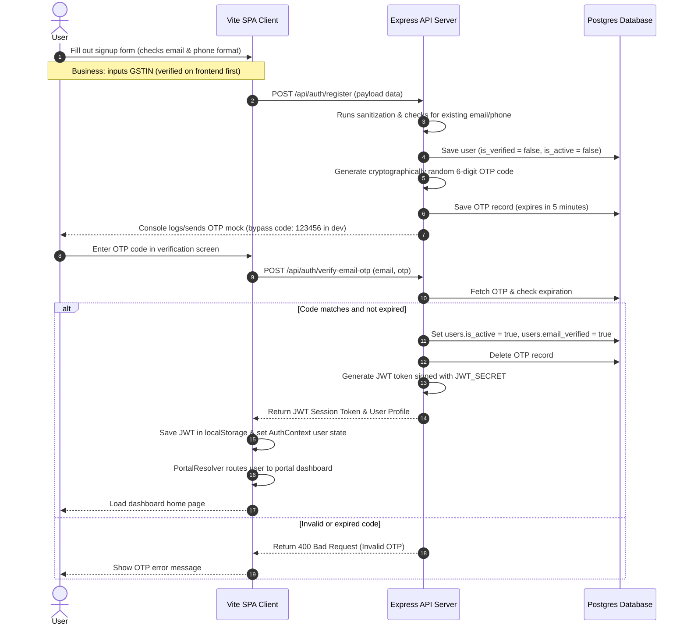

# Chapter 11: Authentication, Authorization & Permissions

---
◀️ **[Previous](RELEASE_CHECKLIST.md)** | 🔼 **[Parent Section](../README.md)** | **[Next](PERFORMANCE.md)** ▶️
---

ARCUS uses a 2-step verification flow: registrations trigger a 6-digit OTP code to verify emails before activating accounts.

### Authorization & Permissions Scope Matrix

Authorized endpoints are protected by `verifyToken` middleware, while admin routes are protected by role-based scope checks (`adminAuthMiddleware`).

| Operational Action | Super Admin | Operations Manager | Inventory Manager | Sales Manager | Customer Support |
| :--- | :---: | :---: | :---: | :---: | :---: |
| **Manage Admins & Roles** | 🟢 Yes | 🔴 No | 🔴 No | 🔴 No | 🔴 No |
| **Edit Global App Config** | 🟢 Yes | 🟢 Yes | 🔴 No | 🔴 No | 🔴 No |
| **Manage Customer Accounts** | 🟢 Yes | 🟢 Yes | 🔴 No | 🟢 Yes | 🔴 No |
| **Manage Product Catalog** | 🟢 Yes | 🟢 Yes | 🟢 Yes | 🔴 No | 🔴 No |
| **Edit Inventory Levels** | 🟢 Yes | 🟢 Yes | 🟢 Yes | 🔴 No | 🔴 No |
| **View Inventory Levels** | 🟢 Yes | 🟢 Yes | 🟢 Yes | 🔴 No | 🟢 Yes |
| **Approve RFQs & Draft Quotes**| 🟢 Yes | 🟢 Yes | 🔴 No | 🟢 Yes | 🟢 Yes |
| **View Revenue Reports** | 🟢 Yes | 🟢 Yes | 🔴 No | 🟢 Yes | 🔴 No |
| **View Audit Logs & Adjustments**| 🟢 Yes | 🔴 No | 🔴 No | 🔴 No | 🔴 No |

* **User Roles**:
  * `Individual`: B2C buyers. Accesses the Individual Dashboard. Uses retail pricing.
  * `Business`: B2B buyers. Accesses the Business Dashboard. Eligible for Net-30 credit terms, project tracking, tax billing, and bulk pricing.
  * `Professional`: Subcontractors and contractors. Accesses the Professional Dashboard to review visit bookings.

---

## 11.3. Complete Access Permission Matrix

| Feature Module / Actions | Guest | Individual User | Business User (B2B) | Verified Professional | Admin |
| :--- | :---: | :---: | :---: | :---: | :---: |
| **Authentication & Profile Setup** | ✅ | ✅ | ✅ | ✅ | ✅ |
| **Browse Product Catalog** | ✅ | ✅ | ✅ | ✅ | ✅ |
| **Product Detail PDP View** | ✅ | ✅ | ✅ | ✅ | ✅ |
| **Materials Checkout & Pay** | ❌ | ✅ | ✅ | ✅ | ✅ |
| **Create B2B RFQ** | ❌ | ❌ | ✅ | ✅ | ✅ |
| **View RFQ Specifications** | ❌ | ❌ | ✅ (Own) | ❌ | ✅ (All) |
| **Submit Quotation / Pricing** | ❌ | ❌ | ❌ | ❌ | ✅ |
| **Approve/Reject Quotation** | ❌ | ❌ | ✅ (Own) | ❌ | ✅ (All) |
| **Quotation Negotiation** | ❌ | ❌ | ✅ (Own) | ❌ | ✅ (All) |
| **Create Project Logs** | ❌ | ❌ | ✅ | ✅ | ✅ |
| **Book Services / Professionals** | ❌ | ✅ | ✅ | ✅ | ✅ |
| **Manage Professional Listings** | ❌ | ❌ | ❌ | ✅ (Own) | ✅ (All) |
| **Admin Command Center** | ❌ | ❌ | ❌ | ❌ | ✅ |
| **KPI Analytics Dashboard** | ❌ | ❌ | ❌ | ❌ | ✅ |
| **View System Audit Logs** | ❌ | ❌ | ❌ | ❌ | ✅ |
| **Admin Settings Management** | ❌ | ❌ | ❌ | ❌ | ✅ |
| **Role & Scope Management** | ❌ | ❌ | ❌ | ❌ | ✅ |
| **Catalog Template Export** | ❌ | ❌ | ❌ | ❌ | ✅ |
| **Catalog Template Import** | ❌ | ❌ | ❌ | ❌ | ✅ |
| **Search Telemetry Analytics** | ❌ | ❌ | ❌ | ❌ | ✅ |

---

---

## 🛡️ CENTRALIZED SANITIZATION & LIMITING (from docs/security.md)
* **XSS Scrubber**: Centralized input sanitization automatically removes script tags, style sheets, and HTML event handlers.
* **SQLi Filter**: Filters block common sql commands (e.g. `UNION`, `SELECT`, `DROP`).
* **Rate Limiters**: Defend login (5/15 mins), registration (5/10 mins), profile updates (10/hr), and OTP dispatch (3/5 mins).

---
◀️ **[Previous](RELEASE_CHECKLIST.md)** | 🔼 **[Parent Section](../README.md)** | **[Next](PERFORMANCE.md)** ▶️
