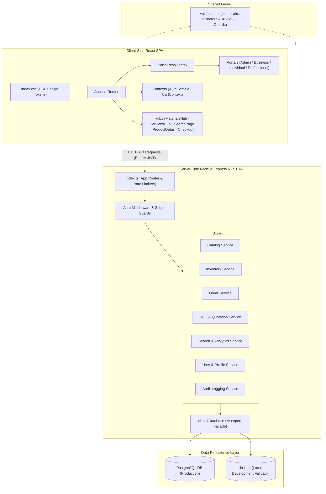

# System Architecture Diagrams

---
◀️ **[Previous](../development/ROADMAP.md)** | 🔼 **[Parent Section](../README.md)** | **[Next](workflows.md)** ▶️
---

This page houses the system diagrams for the ARCUS platform.

## 1. Centralized Application Topology

For more architectural details, see [ARCHITECTURE.md](../architecture/ARCHITECTURE.md).

---
◀️ **[Previous](../development/ROADMAP.md)** | 🔼 **[Parent Section](../README.md)** | **[Next](workflows.md)** ▶️
