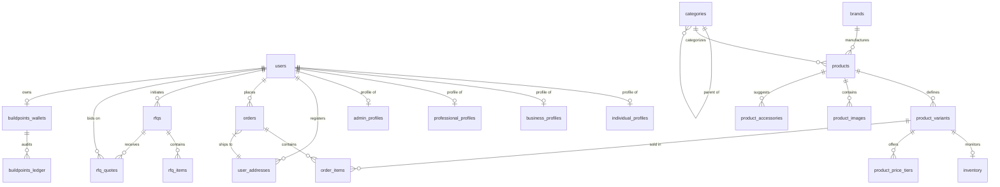

# Database Entity Relationship Diagram (ERD)

---
◀️ **[Previous](sequence.md)** | 🔼 **[Parent Section](../README.md)** | **[Next](../README.md)** ▶️
---

This document presents the visual database schema mapping for the ARCUS platform.

For details on individual table structures and check constraints, see [DATABASE.md](DATABASE.md).

---
◀️ **[Previous](sequence.md)** | 🔼 **[Parent Section](../README.md)** | **[Next](../README.md)** ▶️
