# Transaction Sequence Diagrams

---
◀️ **[Previous](workflows.md)** | 🔼 **[Parent Section](../README.md)** | **[Next](database.md)** ▶️
---


This page collects all system interaction sequence logs.

### 1. User Authentication (Login & Verification)
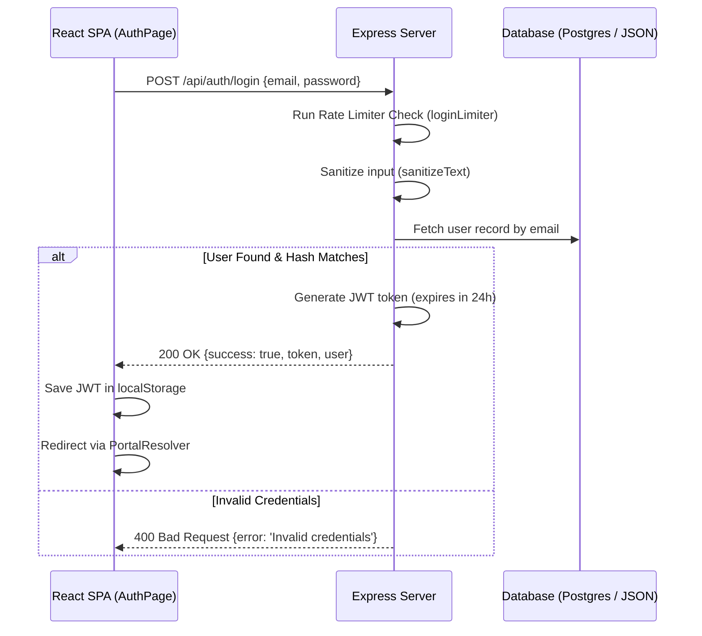

### 2. User Registration & OTP Verification
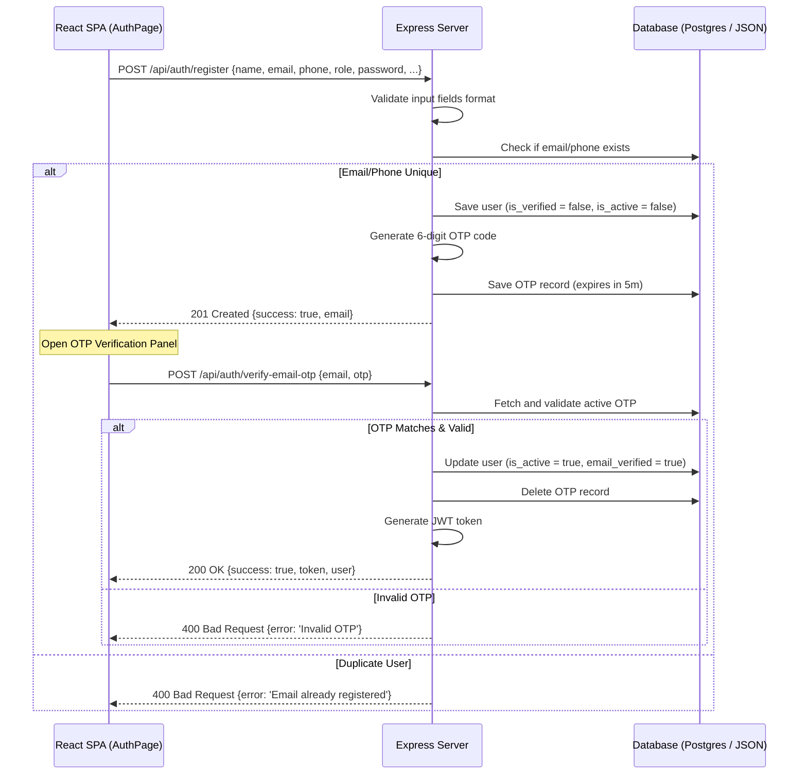


### 3. Materials Purchase Checkout
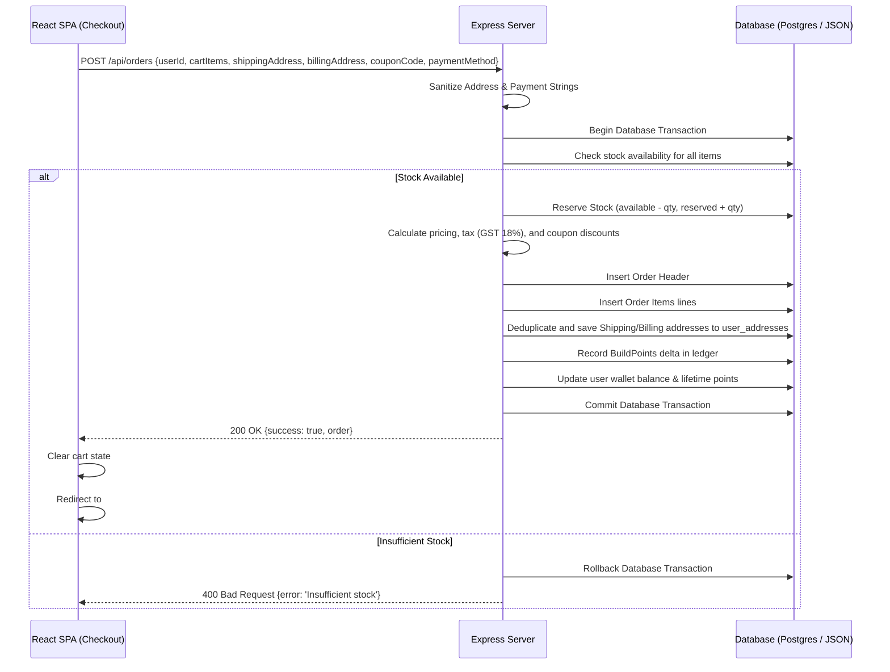

### 4. RFQ Submission
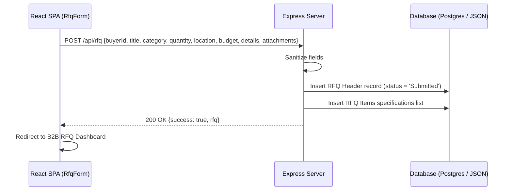

### 5. Quotation Negotiation & Versioning
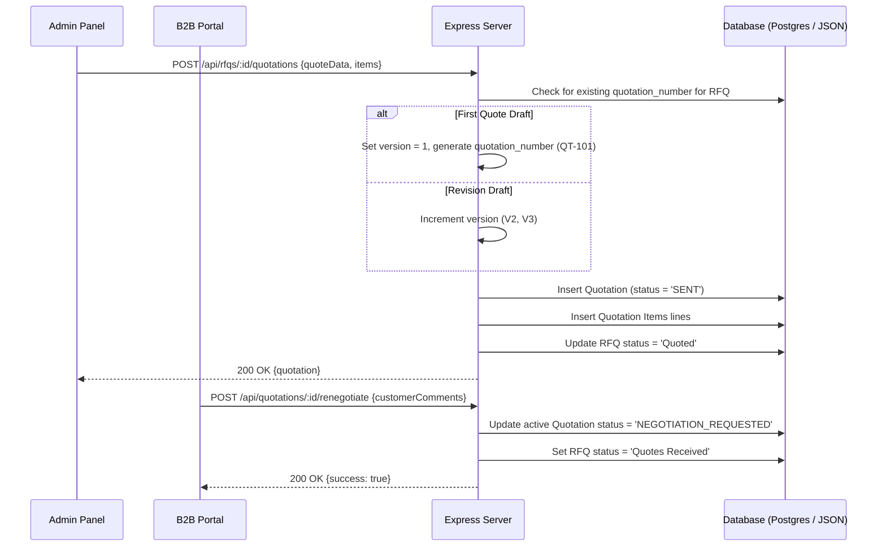

### 6. Search Engine Query & Click Telemetry
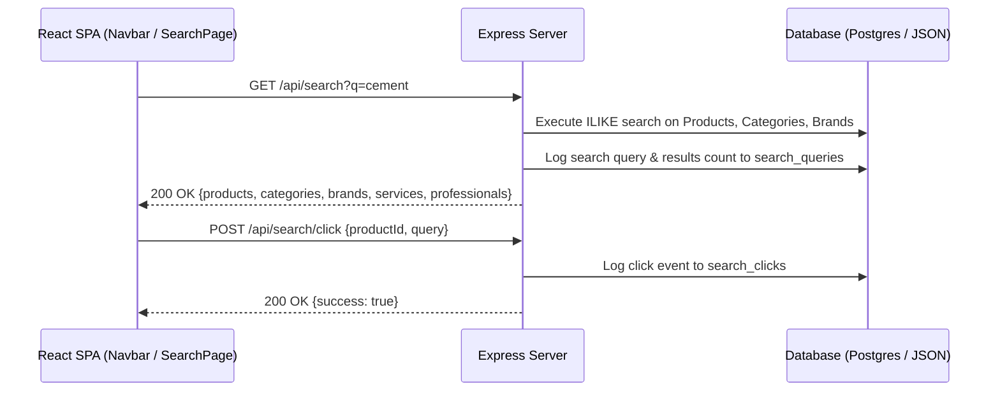

### 7. Product Catalog Bulk Import
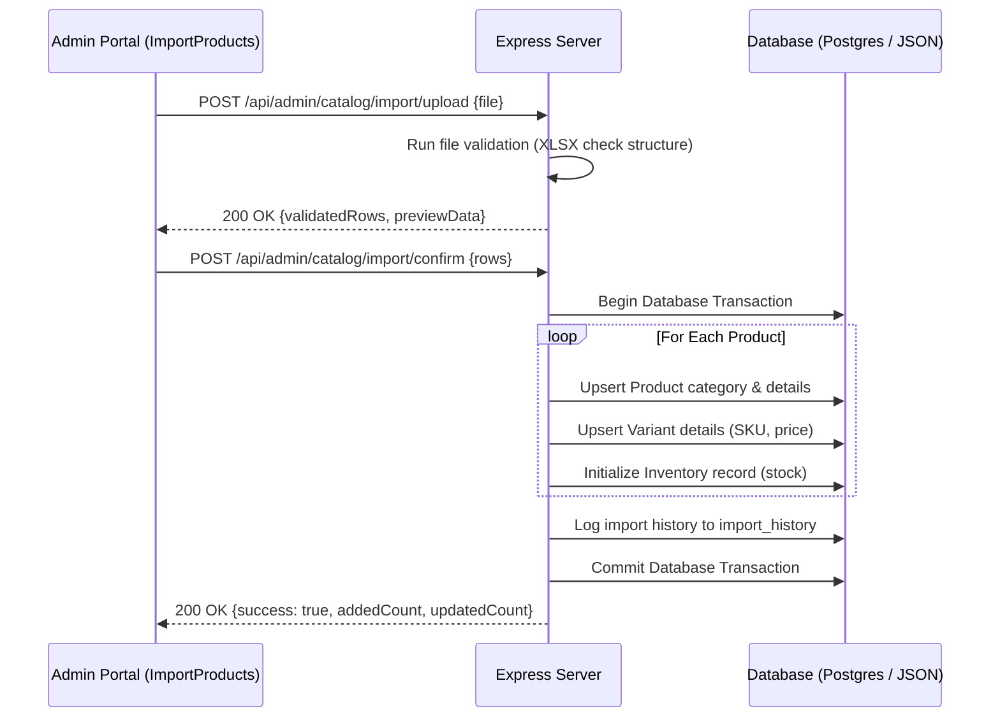

### 8. Order Fulfillment & Status Flow
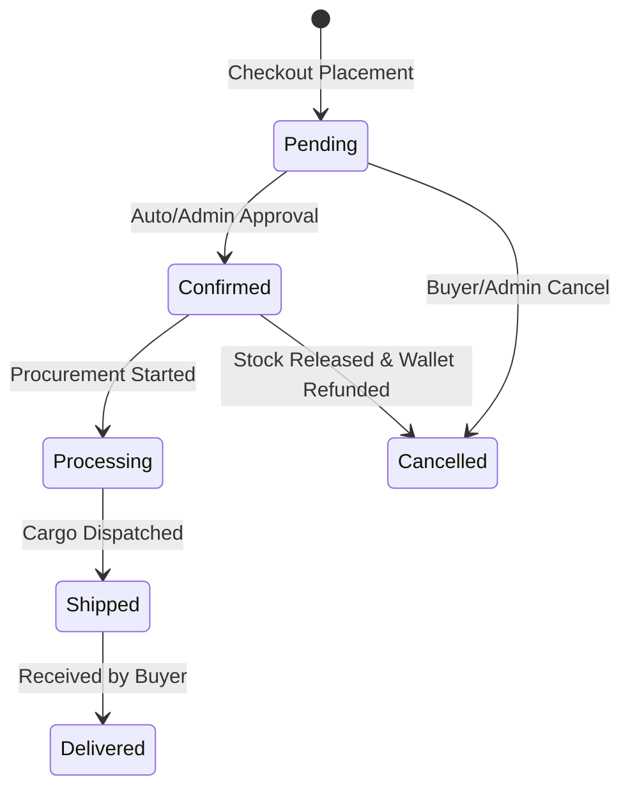

### 9. Inventory Reservation & Safety Stock Alerts
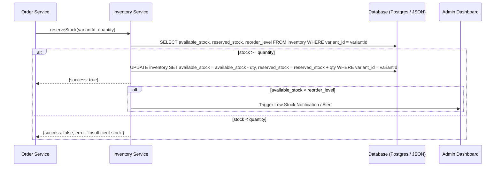

### 10. BuildPoints Double-Entry Wallet Ledger Flow
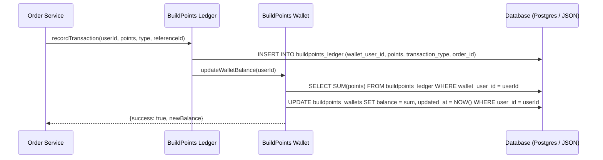

### 11. Product Catalog Export Flow
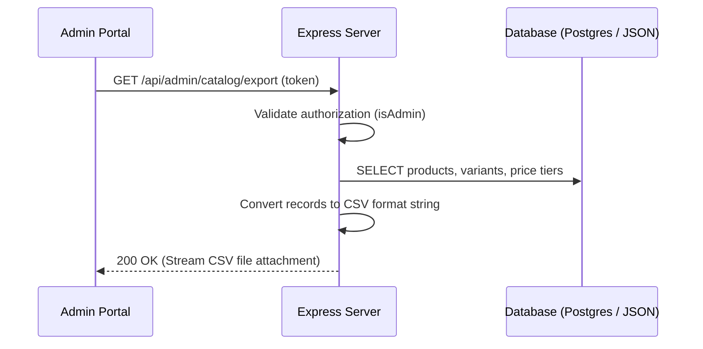

### 12. Catalog Manual Updates & Cache Invalidation Flow
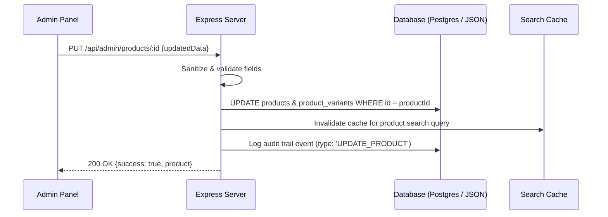

---

## 3.6. Module Dependency Graph
The ARCUS system modules are designed with clear boundaries. Below is the dependency map for each module, illustrating database tables, shared files, and side effects.
The ARCUS system modules are designed with clear boundaries. Below is the dependency map for each module, illustrating databases tables, shared files, and side effects.

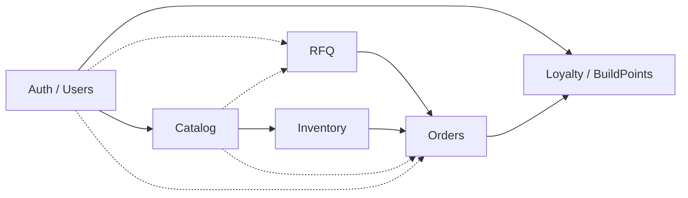

### 1. Authentication & Users Module
* **Depends On**: None.
* **Used By**: Orders, RFQ, Loyalty, Admin, Checkout.
* **Database Tables**: `users`, `otps`, `individual_profiles`, `business_profiles`, `professional_profiles`, `admin_profiles`.
* **Primary APIs**:
  * `POST /api/auth/register` (cross-ref: [Section 6](#6-api-documentation))
  * `POST /api/auth/login` (cross-ref: [Section 6](#6-api-documentation))
  * `GET /api/auth/me` (cross-ref: [Section 6](#6-api-documentation))
* **Shared Components**: `AuthPage.tsx`
* **Side Effects**: Generates JWT session token; updates user profile status.
* **Cross-module interactions**: Links user IDs to wallets on signup; verifies GSTIN for B2B accounts.

### 2. Catalog Module
* **Depends On**: Categories, Brands.
* **Used By**: Search, Orders, RFQ, Inventory.
* **Database Tables**: `products`, `product_variants`, `product_price_tiers`, `categories`, `brands`, `product_images`, `product_accessories`, `product_reviews`.
* **Primary APIs**:
  * `GET /api/products` (cross-ref: [Section 6](#6-api-documentation))
  * `GET /api/products/:id` (cross-ref: [Section 6](#6-api-documentation))
* **Shared Components**: `MaterialsHub.tsx`, `ProductDetail.tsx`.
* **Side Effects**: None.
* **Cross-module interactions**: Supplies SKU identifiers and volume pricing parameters to checkout services.

### 3. Inventory Module
* **Depends On**: Catalog.
* **Used By**: Orders, Catalog.
* **Database Tables**: `inventory`, `inventory_adjustments`.
* **Primary APIs**:
  * `PUT /api/admin/inventory/:id` (cross-ref: [Section 6](#6-api-documentation))
* **Shared Components**: `InventoryManagement.tsx`
* **Side Effects**: Manual adjustments trigger low-stock alerts.
* **Cross-module interactions**: Restricts checkout orders if quantities exceed available stock levels.

### 4. Orders Module
* **Depends On**: Catalog, Inventory, Users, Loyalty.
* **Used By**: Checkout, Admin.
* **Database Tables**: `orders`, `order_items`, `user_addresses`.
* **Primary APIs**:
  * `POST /api/orders` (cross-ref: [Section 6](#6-api-documentation))
  * `GET /api/orders` (cross-ref: [Section 6](#6-api-documentation))
* **Shared Components**: `Checkout.tsx`, `IndividualOrders.tsx`.
* **Side Effects**: Deduplicates address records, reserves stock, awards BuildPoints.
* **Cross-module interactions**: Order status updates (e.g. Cancelled) release reserved inventory.

### 5. RFQ Module
* **Depends On**: Users, Catalog, Orders.
* **Used By**: Business, Admin.
* **Database Tables**: `rfqs`, `rfq_items`, `quotations`, `quotation_items`.
* **Primary APIs**:
  * `POST /api/rfq` (cross-ref: [Section 6](#6-api-documentation))
  * `POST /api/rfqs/:id/quotations` (cross-ref: [Section 6](#6-api-documentation))
  * `POST /api/quotations/:id/accept` (cross-ref: [Section 6](#6-api-documentation))
* **Shared Components**: `RfqForm.tsx`, `RFQManagement.tsx`.
* **Side Effects**: Auto-converts quotation to order, marks RFQ as completed, updates inventory stock levels.
* **Cross-module interactions**: Accept quotes calls `convertQuotationToOrder` in the Orders Service.

### 6. Loyalty Module
* **Depends On**: Users, Orders.
* **Used By**: Orders, Checkout.
* **Database Tables**: `buildpoints_wallets`, `buildpoints_ledger`.
* **Primary APIs**: None.
* **Shared Components**: `Navbar.tsx`, `Checkout.tsx`.
* **Side Effects**: Wallet updates verify wallet balance equals the sum of ledger points.
* **Cross-module interactions**: Accrues points on orders.

---

## 3.7. Event Lifecycle Documentation
Below are the downstream processes triggered by system events.
Below are the downstream processes triggered by system events.

### 1. Event: `Order Created`
```mermaid
graph TD
    OrderCreated[Order Checkout Successful] --> ReserveInv[Reserve Inventory (available_stock - qty, reserved_stock + qty)]
    ReserveInv --> GenLedger[Generate Ledger Entry (buildpoints_ledger - credit points delta)]
    GenLedger --> AwardBP[Award BuildPoints (buildpoints_wallets - update balance)]
    AwardBP --> GenInvoice[Generate Tax Invoice (SGST 9%, CGST 9%)]
    GenInvoice --> SendEmail[Send Confirmation Email (SMTP via Nodemailer)]
    SendEmail --> WriteAudit[Write Audit Log (action: 'CREATE_ORDER')]
    WriteAudit --> RefreshDashboard[Refresh Dashboards (Admin orders grid & User portal update)]
```

### 2. Event: `Registration Completed`
```mermaid
graph TD
    RegSubmit[Registration Form Submitted] --> CreateUnverified[Create unverified User Record (is_active = false)]
    CreateUnverified --> InitWallet[Initialize Loyalty Wallet (set balance = 0)]
    InitWallet --> GenOTP[Generate 6-digit verification code]
    GenOTP --> SendMockSMS[Log code in Console / Send Mock SMS]
    SendMockSMS --> OpenPopup[Open OTP Verification Popup on Frontend]
```

### 3. Event: `RFQ Submitted`
```mermaid
graph TD
    RfqSubmit[User Submits RFQ Specs] --> CreateRfqHeader[Create RFQ Header record (status = 'Submitted')]
    CreateRfqHeader --> WriteItems[Write RFQ spec lines to rfq_items]
    WriteItems --> AdminNotify[Trigger Back-office Admin Notification (Alert details)]
    AdminNotify --> WriteAudit[Write Audit Log (action: 'SUBMIT_RFQ')]
```

### 4. Event: `Quotation Approved`
```mermaid
graph TD
    QuoteApprove[User Accepts Quote QT-101-V2] --> SetQuoteApproved[Set Quotation status = 'APPROVED']
    SetQuoteApproved --> ConvertToOrder[Trigger convertQuotationToOrder()]
    ConvertToOrder --> RetrieveProfile[Retrieve B2B buyer profile (checks GST & company)]
    RetrieveProfile --> FormatItems[Format order items & assign variant parameters]
    FormatItems --> CreateOrder[Create active Order (status = 'Confirmed')]
    CreateOrder --> AccrueBP[Accrue BuildPoints (double points for Contractors)]
    AccrueBP --> SetRfqCompleted[Set RFQ status = 'Completed']
```

### 5. Event: `Inventory Adjustment`
```mermaid
graph TD
    InvAdjust[Admin Manually Adjusts SKU Stock] --> UpdateStock[Update available_stock in inventory table]
    UpdateStock --> WriteTrail[Write detailed record to inventory_adjustments (type, reason)]
    WriteTrail --> WriteAudit[Write Audit Log (action: 'ADJUST_STOCK')]
    WriteAudit --> CheckThreshold{available_stock < reorder_level?}
    CheckThreshold -- Yes --> TriggerAlert[Trigger Low Stock Alert / Notification]
    CheckThreshold -- No --> End[End]
```

### 6. Event: `User Verification`
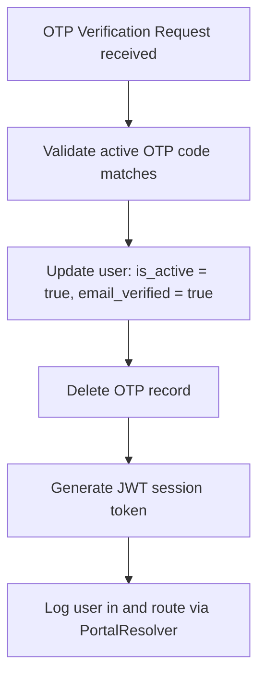

### 7. Event: `Admin Approval`
```mermaid
graph TD
    AdminApprove[Admin Action: Approve Registration / Quotation] --> VerifyScope[Verify Admin Role & Permissions Scope]
    VerifyScope --> UpdateStatus[Update Target status to APPROVED/ACTIVE]
    UpdateStatus --> WriteAudit[Write Audit Log (action: 'ADMIN_APPROVED')]
    WriteAudit --> NotifyTarget[Notify corresponding User / Supplier via Email/System Alert]
```

---

---


---
◀️ **[Previous](workflows.md)** | 🔼 **[Parent Section](../README.md)** | **[Next](database.md)** ▶️
