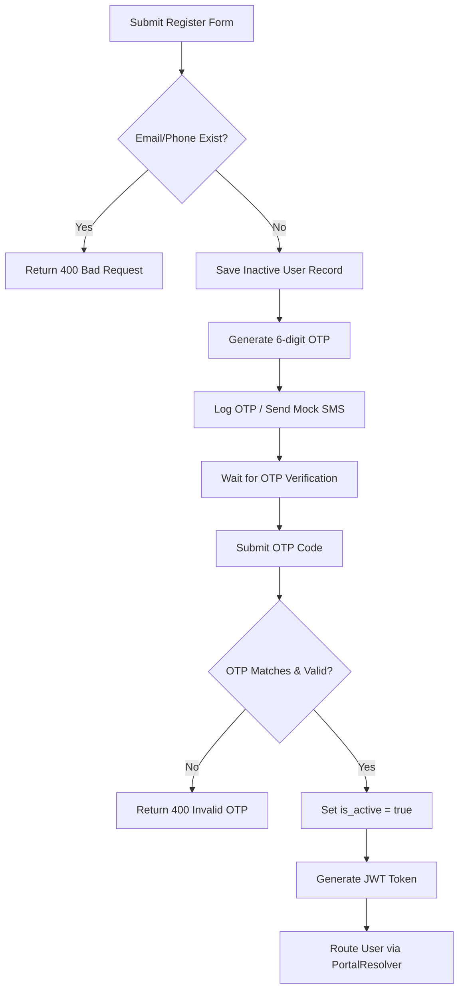
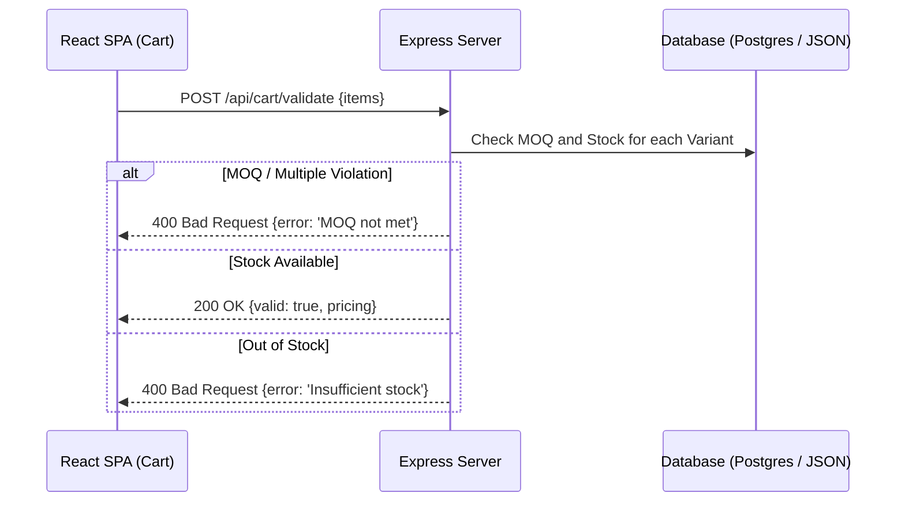
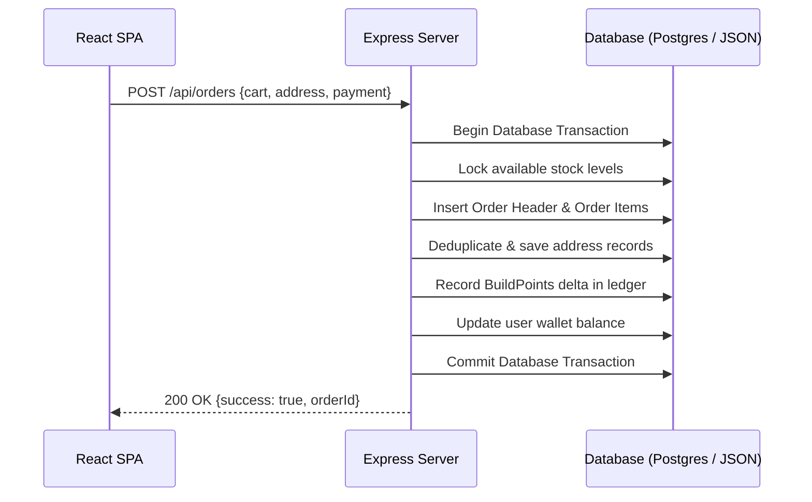

# Business Workflow Flowcharts

---
◀️ **[Previous](architecture.md)** | 🔼 **[Parent Section](../README.md)** | **[Next](sequence.md)** ▶️
---

This page documents the user journey flowcharts for standard retail/commercial flows.

### 1. Customer Registration Flow

### 2. Product Purchase & Cart Validation Flow

### 3. Order Checkout Flow

For more workflows, see [RFQ_WORKFLOW.md](../business/RFQ_WORKFLOW.md).

---
◀️ **[Previous](architecture.md)** | 🔼 **[Parent Section](../README.md)** | **[Next](sequence.md)** ▶️
