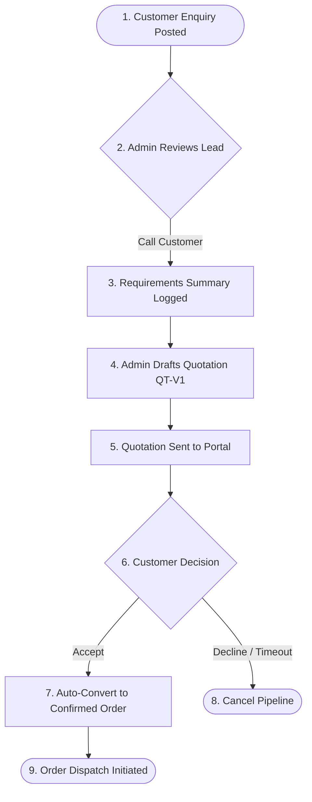
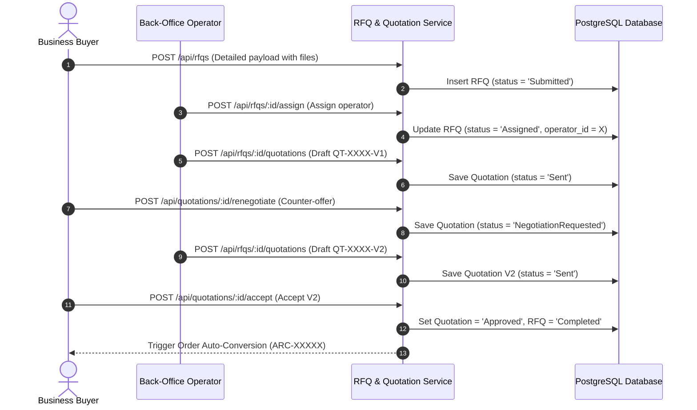

# 02_RFQ_WORKFLOWS — RFQ Suite Business Workflows

## Document Metadata
* **Title**: ARCUS RFQ Suite Business Workflows
* **Purpose**: Technical workflow blueprints mapping the operational lifecycles, team assignment sequences, communication routes, and order conversion flows.
* **Version**: v1.0
* **Status**: Proposed / Review Required
* **Last Updated**: 2026-06-26
* **Maintainer**: Principal Backend Engineer / Lead Systems Analyst
* **Related Documents**:
  - [01_RFQ_WORKSPACE.md](file:///d:/Claude%20Code/Arcus/docs/rfq/01_RFQ_WORKSPACE.md)
  - [07_RFQ_STATES.md](file:///d:/Claude%20Code/Arcus/docs/rfq/07_RFQ_STATES.md)
* **Estimated Reading Time**: 12 minutes

---

## 1. Simple RFQ Requisition Flow

Used for quick leads submitted from public homepages or basic product catalogs. Renders a rapid sequence converting leads into quotes via manual calls.

---

## 2. Detailed B2B RFQ Requisition Flow

Used for corporate procurement where clients input line items, quantities, and upload engineering drawing blueprints.

---

## 3. Operational Support Workflows

### A. Team Assignment Workflow
Every submitted RFQ triggers a notification banner inside the Admin Portal.
* **Auto-Assignment Rules**: Can route to specific operators based on product categories (e.g. steel items route to Metals Desk).
* **Manual Re-routing**: Super Admins can override and reassign active operators via `/api/rfqs/:id/assign` API endpoints.

### B. Comments & Collaboration
* **Internal Discussion (Private)**: Back-office operators and warehouse logistics specialists log notes in the timeline feed (marked `is_internal = true`). These details are completely hidden from customer portals.
* **Customer Communication (Public)**: Operators send messages to customer screens. The timeline logs entries showing name badges.

### C. Version History & Audits
* **Immutability Principle**: Historical quotations are never overwritten. Every revision creates a new version record (`V1`, `V2`, `V3`) pointing to the parent RFQ, ensuring full transparency.
* **Audit Logging**: Any state shift, price modification, assignment change, or attachment deletion writes entries to `activity_logs` tables.

### D. Cancellation & Reopening
* **Cancellation**: Buyers or administrators can cancel open RFQs at any phase prior to order conversion.
* **Reopening**: Operators can reactivate cancelled or expired RFQs, resetting state flows to `UnderReview`.

### E. Expiry & Date Controls
* **Validity Period**: Admin quotations default to a **7-day expiry deadline**.
* **Auto-Expiry Sweep**: A cron task runs nightly. Quotations passing their expiration deadlines are set to `Expired`, and the parent RFQ status resets to `Open` (allowing renegotiations or quote drafts).
