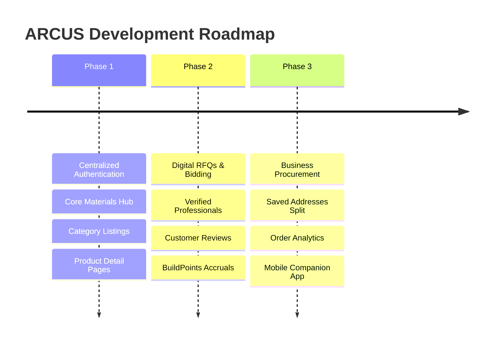

# 🗺️ ARCUS Roadmap

Development milestones for the ARCUS platform are split into three core implementation phases.

## 🚀 Development Phases

```mermaid
timeline
    title ARCUS Development Roadmap
    Phase 1 : Centralized Authentication : Core Materials Hub : Category Listings : Product Detail Pages
    Phase 2 : Digital RFQs & Bidding : Verified Professionals : Customer Reviews : BuildPoints Accruals
    Phase 3 : Business Procurement : Saved Addresses Split : Order Analytics : Mobile Companion App
```
