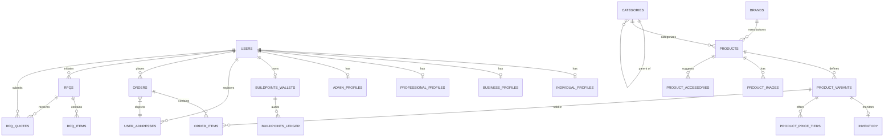

# ARCUS Commerce Platform: Database Schema Documentation

This document describes the redesigned database structure of the ARCUS commerce platform. The schema supports B2C/B2B material marketplaces, services directories, RFQ management, and loyalty ledger systems.

---

## 1. Entity Relationship Diagram (ERD)

---

## 2. Table-by-Table Data Dictionary

### A. Identity & Profiles

#### `users`
Tracks authentication credentials, core status, and customer categorization.
* `id` (VARCHAR(50), Primary Key): Stripe-style prefixed string (e.g. `user_...`).
* `email` (VARCHAR(100), Unique): Lowercased user email address.
* `phone` (VARCHAR(50), Unique): Verified primary contact phone number.
* `password_hash` (VARCHAR(256)): Password hash.
* `password_salt` (VARCHAR(256)): Salt.
* `role` (VARCHAR(50)): General role (e.g. `'USER'`, `'ADMIN'`).
* `customer_type` (ENUM `customer_type_enum`): User tier (`'INDIVIDUAL'`, `'BUSINESS'`, `'PROFESSIONAL'`).
* `email_verified` (BOOLEAN): Verified flag.
* `is_active` (BOOLEAN): Status toggle.
* `created_at` (TIMESTAMPTZ): Signup timestamp.

#### `individual_profiles`
Stores personal details for B2C customers.
* `user_id` (VARCHAR(50), Primary Key): References `users(id)` (ON DELETE CASCADE).
* `full_name` (VARCHAR(100)): Full name.
* `alternate_phone` (VARCHAR(50)): Secondary phone number.
* `preferred_language` (VARCHAR(50)): Customer support language preference.

#### `business_profiles`
Contains company profiles and verification status for B2B procurement clients.
* `user_id` (VARCHAR(50), Primary Key): References `users(id)` (ON DELETE CASCADE).
* `company_name` (VARCHAR(150)): Company name.
* `gst_number` (VARCHAR(50)): Unique GST registration number.
* `pan_number` (VARCHAR(10)): Income tax PAN identifier.
* `trade_license_url` (VARCHAR(255)): Document link for verification.
* `verification_status` (ENUM `verification_status_enum`): Verification workflow status.

#### `professional_profiles`
Manages contractor portfolio URLs and service categories.
* `user_id` (VARCHAR(50), Primary Key): References `users(id)` (ON DELETE CASCADE).
* `business_profile_id` (VARCHAR(50)): Optional references `business_profiles(user_id)`.
* `service_category` (VARCHAR(100)): Main service category (e.g. Plumbing, Electrical).
* `experience_years` (INTEGER): Years in trade.
* `city` / `state` (VARCHAR(100)): Regional workspace.
* `website_url` / `portfolio_url` (VARCHAR(150)): Portfolio links.
* `bio` (TEXT): Description/About statement.
* `skills` (JSONB): Array list of specific skills.
* `average_rating` (NUMERIC(3,2)): Aggregated star count from customer reviews.

#### `user_addresses`
Standardizes delivery destinations, replacing flat address strings.
* `id` (VARCHAR(50), Primary Key): Address ID.
* `user_id` (VARCHAR(50)): References `users(id)` (ON DELETE CASCADE).
* `address_type` (ENUM `address_type_enum`): `'SHIPPING'` or `'BILLING'`.
* `recipient_name` (VARCHAR(100)): Contact person.
* `phone_number` (VARCHAR(50)): Contact number.
* `address_line_1` / `address_line_2` (TEXT): Street addresses.
* `city` / `state` / `postal_code` (VARCHAR): Standard location fields.

---

### B. Catalog & Products

#### `categories`
Hierarchical category tree with self-referencing joins.
* `id` (VARCHAR(50), Primary Key): Category ID.
* `name` (VARCHAR(100)): Display name.
* `slug` (VARCHAR(100), Unique): URL slug.
* `icon` (VARCHAR(50)): Material Icon identifier.
* `parent_id` (VARCHAR(50)): References `categories(id)`. Null represent top-level.

#### `products`
The core catalog item description, independent of specific size/packaging SKUs.
* `id` (VARCHAR(50), Primary Key): Catalog item ID.
* `brand_id` (VARCHAR(50)): References `brands(id)`.
* `leaf_category_id` (VARCHAR(50)): References `categories(id)`.
* `name` (VARCHAR(150)): Title.
* `description` (TEXT): Detailed documentation.
* `gst_rate` (NUMERIC(5,2)): Default tax rate percentage (e.g. 18.00).

#### `product_variants`
The specific SKU. Each product variant has its own price, dimensions, and MOQ.
* `id` (VARCHAR(50), Primary Key): SKU variant ID.
* `product_id` (VARCHAR(50)): References `products(id)` (ON DELETE CASCADE).
* `sku` (VARCHAR(100), Unique): Stock Keeping Unit reference.
* `attributes` (JSONB): Spec configurations (e.g. `{"size": "2 Inch", "sdr": "11"}`).
* `price` (NUMERIC(12,2)): Default base price per unit.
* `unit_of_measure` (VARCHAR(50)): Packaging unit (e.g. Piece, Bag, Box).

#### `product_price_tiers`
Volume discounts per SKU variant.
* `variant_id` (VARCHAR(50)): References `product_variants(id)` (ON DELETE CASCADE).
* `min_quantity` / `max_quantity` (INTEGER): Volume thresholds.
* `price` (NUMERIC(12,2)): Discounted price.
* `discount_percentage` (NUMERIC(5,2)): Rate of discount.

---

### C. RFQ System

#### `rfqs`
RFQs containing timelines and shipping address parameters.
* `id` (VARCHAR(50), Primary Key): RFQ ID.
* `buyer_id` (VARCHAR(50)): References `users(id)` (ON DELETE CASCADE).
* `title` (VARCHAR(255)): RFQ title.
* `location_city` / `location_state` (VARCHAR(100)): Target project region.
* `shipping_address_id` (VARCHAR(50)): References `user_addresses(id)`.
* `timeline_urgency` (VARCHAR(100)): Timeline requirements.
* `status` (ENUM `rfq_status_enum`): Bid lifecycle status.

#### `rfq_items`
Individual line items under an RFQ.
* `id` (VARCHAR(50), Primary Key): RFQ line item ID.
* `rfq_id` (VARCHAR(50)): References `rfqs(id)` (ON DELETE CASCADE).
* `product_id` (VARCHAR(50)): Optional references `products(id)`.
* `item_name` (VARCHAR(150)): Description.
* `quantity` (VARCHAR(100)): Quantity and unit.

---

### D. Loyalty Ledger

#### `buildpoints_wallets`
Maintains customer points balances and tier indicators.
* `user_id` (VARCHAR(50), Primary Key): References `users(id)` (ON DELETE CASCADE).
* `balance` (INTEGER): Points balance.
* `tier` (VARCHAR(50)): Tier level (Bronze, Silver, Gold, Platinum).

#### `buildpoints_ledger`
Double-entry points ledger history.
* `wallet_user_id` (VARCHAR(50)): References `buildpoints_wallets(user_id)` (ON DELETE CASCADE).
* `points` (INTEGER): Points delta (credits positive, debits negative).
* `transaction_type` (ENUM `buildpoints_transaction_type_enum`): Transaction type.
* `reference_type` (VARCHAR(50)): Origin context (e.g. `'ORDER'`, `'ADMIN'`).
* `reference_id` (VARCHAR(50)): Order ID or sync transaction reference.
